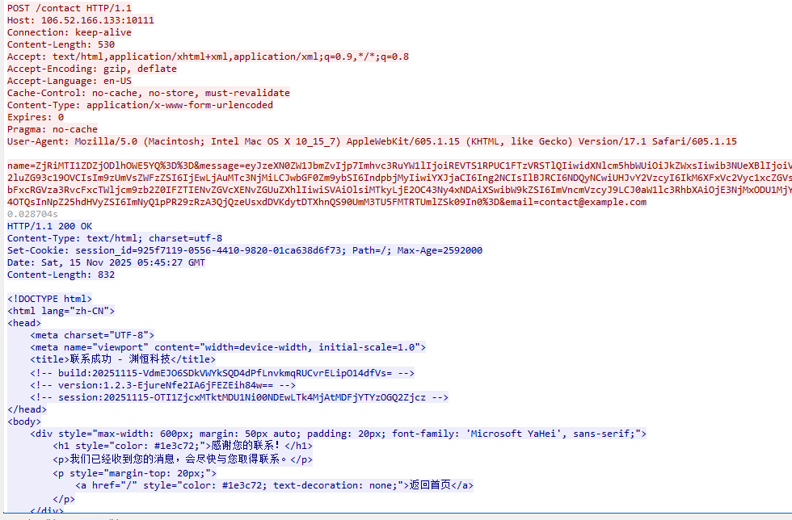
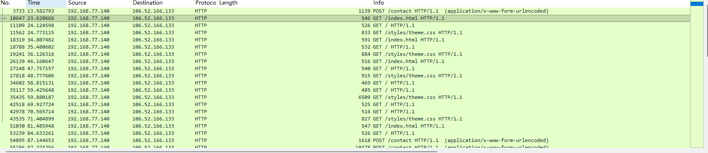
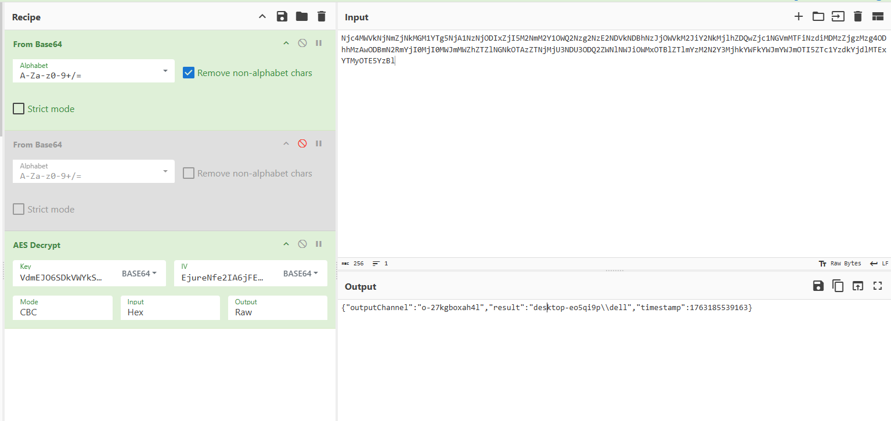
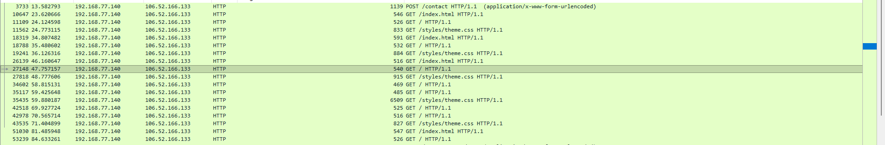
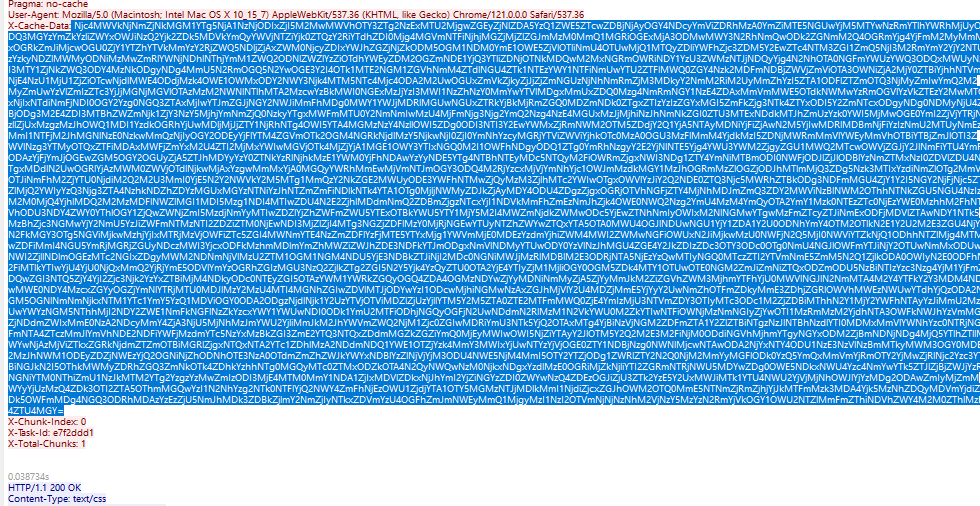
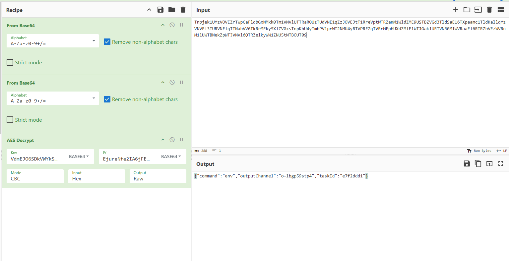
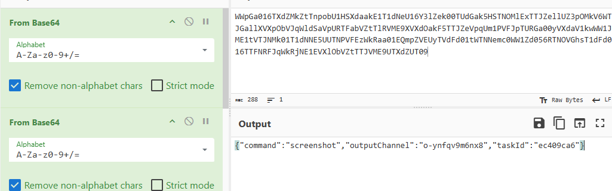

Forensics Challenge: Asgard Fallen Down

这是一题取证挑战,升级了Shadow of Asgard中的C2通信流程，在注册流程和加密方式上有所修改。同时受害主机的反制措施也加大了取证的难度。

1. Challenge 1: The First Command

   After successfully infiltrating Thor's machine, Loki's agent came to life. Like all beginnings, the first action reveals intent.

   Hidden among thousands of scanning requests and server responses, Loki issued his opening move—the first command that set his plan in motion.

   **Question:** What was the first command Loki executed after his agent established connection?

   **Flag Format:** complete_command (The exact command Loki sent to the agent)

   

这个C2还是使用http通道，通过WIreshark打开流量包并使用http作为过滤条件，可以发现想要筛选出可疑的请求包比较困难，可以使用长度排序，这个时候就能排查出不太符合通常情况下扫描器访问的流量特征，也就是/contact路由


追踪contact路由，可以使用**_ws.col.info == "POST /contact HTTP/1.1  (application/x-www-form-urlencoded)"**作为筛选器进行筛选


此时可以发现最早触发contact路由的时间是12-13左右, 追踪这个http流（**tcp.stream eq 207**）可以发现响应包HTML注释中有**三行反常注释**（通过简单分析可以推测出build和version大概率是AES Key & IV，以及Session则是标识Agent注册的id）：

```
    <!-- build:20251115-VdmEJO6SDkVWYkSQD4dPfLnvkmqRUCvrELipO14dfVs= -->
    <!-- version:1.2.3-EjureNfe2IA6jFEZEih84w== -->
    <!-- session:20251115-OTI1ZjcxMTktMDU1Ni00NDEwLTk4MjAtMDFjYTYzOGQ2Zjcz -->
```



继续分析该流，可以发现**后续注释中的Session已经成为Thor主机发送请求的cookie值**，那么可以通过这个Cookie作为条件筛选出Thor Agent和LokiC2 Server进程的通信

**此时选择过滤器：http.cookie contains "session_id=925f7119-0556-4410-9820-01ca638d6f73"** 后续的取证流程就并不复杂了



那么我们接下来就要关注C2是怎么下发任务的从而使Thor主机获取到任务的，可以追踪第二个 GET/index.html的流，这里可以发现返回首页的响应中依旧包含了一套加密后的注释

```
<!-- build:20251115-TUdZeU9HVXdabVl4T0dFd1pXWmxObU5oWVRNellqWm1PV0ZtWkdFM1lqa3hNRGd5TldJNVptWTNZMk16TVRkaFpqUXpZbVExWVRRMlpUUXpOVGN4Tm1ZelkySTNOREUxWmpWak1UZ3dNRGd3Tm1NMU1tUTVaakEzTmpZelpHTmlNREE0T0dJMk9HUTJPVGhpT0RZMk5HSXpNV1kyT0RRMU1UY3dZVGt5TkdNNE1XRmhZakk1TXpka016TTJaRGMyWmpjMk5ETXlZMlk0WlRaa01EVXlZZz09 -->
```

这里服务端下发任务的加密逻辑就是**AES-->hex-->base64-->base64**


同时Thor Agent主要是通过**GET /styles/theme.css**  利用X-Cache-Data回传命令结果，它的加密逻辑则是**AES-->hex-->base64**



Challenge1的答案也就显而易见，由于是在注册Agent之后的第二个请求流，上面解密出的spawn whoami即为Loki执行的命令

2. Challenge 2: The Heartbeat

   Thor's attacks were chaotic—random intervals, sporadic bursts, the rhythm of fury. But Loki's agent operated with cold precision.

   Buried in the noise, the agent sent regular heartbeats back to its master, each pulse proving it remained alive and obedient. These signals followed a steady cadence, mechanical and unwavering.

   Find the pattern. Find the pulse.

   **Question:** How many seconds passed between each heartbeat of Loki's agent?

   **Flag Format:** integer (e.g., 30)

   **此时选择过滤器：http.cookie contains "session_id=925f7119-0556-4410-9820-01ca638d6f73"**  以时间排序可以看出每轮交互大概都相互间隔十秒

   每轮交互的规律：
   GET /index.html -->GET Task
   GET / -->Task Acknowledgment
   GET /styles/theme.css -->  Submit Output

   

3. Challenge 3: The Heart of Iron

   "Every warrior has a heart that drives them. For mortals, it beats with blood. For machines, it pulses with silicon and electricity. Loki, ever curious, sought to know the very core of Thor's weapon—the processor that powers his digital fortress."

   During his infiltration, Loki commanded his agent to enumerate the environment, cataloging every detail of Thor's system. Among the mundane variables and paths, one piece of information reveals the machine's very identity—its processor, the beating heart of computation.

   Like a smith examining the forge that created a sword, Loki identified the specific metal and make of Thor's processor.

   **Question:** What processor model powers Thor's machine?

   **Flag Format:** Complete_Processor_Model_String (e.g., Intel64 Family 6 Model 85 Stepping 4, GenuineIntel

   同样的解密流程，**以_ws.col.info == "GET /styles/theme.css HTTP/1.1 "作为筛选器，慢慢遍历解密即可获取到env命令的回显结果 从而获取到Thor的处理器型号为Intel64 Family 6 Model 191 Stepping 2, GenuineIntel**
   ·

   

   

   

4. Challenge 4: Odin's Eye

   "Odin sacrificed his eye to drink from Mimir's well and gain wisdom. Loki needs no such sacrifice—he simply steals the sight of others."

   In the final moments before vanishing, Loki commanded his agent to capture what Thor's own eyes were seeing—a snapshot of the screen, frozen in time. Within this stolen image lies evidence of Thor's own weapons, the very tools he was using to hunt Loki.

   The irony is exquisite: Thor's scanner, visible on his own screen, was documented by the very enemy he sought to find.

   **Question:** According to the screenshot Loki exfiltrated, which vulnerability scanning tool was Thor running at that moment?

   **Flag Format:** ToolGithubRepoName (e.g., if the tool's repository is https://github.com/user/AwesomeTool, answer AwesomeTool)

   第四题则是还原图片，这里由于在前面遍历过了命令的逻辑，发现**对应Date: Sat, 15 Nov 2025 05:46:39 GMT的时间段，执行了screenshot命令**

   

   可以看到后续的流大多数是**携带数据量相似的POST /contact**

   

   这里由于图片文件数据一般比较大，不适合使用GET传输数据，因此使用了POST /contact分块传输

   

   同样的加密逻辑，不过由于进行了分块，所以需要把这些数据整合起来解密，保证数据的完整性

   这里只要将数据正则提取拼接解密 就可以得到图片的base64 最后解编码另存为1.jpg，就可以获取到扫描器的截图

   

   对应的很容易看出这是TscanPlus

   

最后获取到flag
**RCTF{Wh1l3_Th0r_Struck_L1ghtn1ng_L0k1_St0l3_Th3_Thr0n3}**