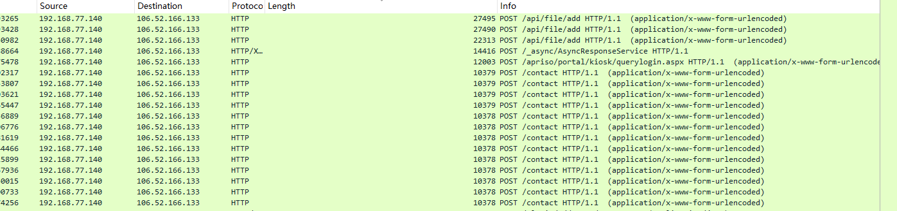
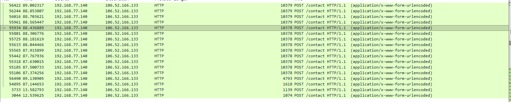
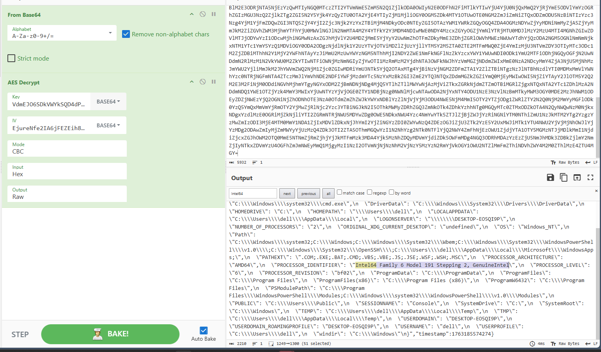
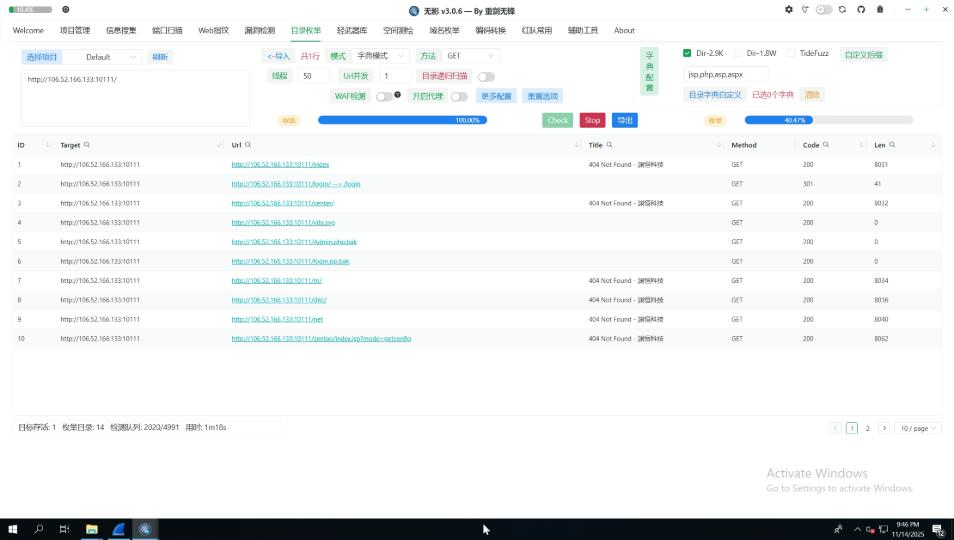

Forensics Challenge: Asgard Fallen Down

This is a forensics challenge that upgrades the C2 communication process from Shadow of Asgard, with modifications to the registration process and encryption methods. Additionally, the victim host's countermeasures have increased the difficulty of forensic analysis.

1. Challenge 1: The First Command

   After successfully infiltrating Thor's machine, Loki's agent came to life. Like all beginnings, the first action reveals intent.

   Hidden among thousands of scanning requests and server responses, Loki issued his opening move—the first command that set his plan in motion.

   **Question:** What was the first command Loki executed after his agent established connection?

   **Flag Format:** complete_command (The exact command Loki sent to the agent)

   

This C2 still uses HTTP channels. Opening the traffic capture in Wireshark and filtering by HTTP, we find it difficult to filter out suspicious request packets. We can sort by length, which helps identify traffic characteristics that don't match typical scanner access patterns—specifically the `/contact` route.



Tracking the contact route, we can use **`_ws.col.info == "POST /contact HTTP/1.1  (application/x-www-form-urlencoded)"`** as a filter.



At this point, we can see the earliest trigger of the contact route was around 12-13. Following this HTTP stream (**tcp.stream eq 207**), we find **three unusual comments** in the HTML response (through simple analysis, we can deduce that build and version are likely the AES Key & IV, and Session is the identifier for the registered Agent):

```
    <!-- build:20251115-VdmEJO6SDkVWYkSQD4dPfLnvkmqRUCvrELipO14dfVs= -->
    <!-- version:1.2.3-EjureNfe2IA6jFEZEih84w== -->
    <!-- session:20251115-OTI1ZjcxMTktMDU1Ni00NDEwLTk4MjAtMDFjYTYzOGQ2Zjcz -->
```


Continuing to analyze this stream, we discover that **the Session in subsequent comments has become the cookie value in Thor's host request**. We can use this Cookie as a condition to filter out communications between Thor Agent and Loki C2 Server.

**Filter: `http.cookie contains "session_id=925f7119-0556-4410-9820-01ca638d6f73"`** - the subsequent forensic process becomes straightforward.


Next, we need to focus on how the C2 issues tasks for Thor's host to receive. We can track the second GET /index.html stream, where we find the homepage response still contains an encrypted set of comments:

```
<!-- build:20251115-TUdZeU9HVXdabVl4T0dFd1pXWmxObU5oWVRNellqWm1PV0ZtWkdFM1lqa3hNRGd5TldJNVptWTNZMk16TVRkaFpqUXpZbVExWVRRMlpUUXpOVGN4Tm1ZelkySTNOREUxWmpWak1UZ3dNRGd3Tm1NMU1tUTVaakEzTmpZelpHTmlNREE0T0dJMk9HUTJPVGhpT0RZMk5HSXpNV1kyT0RRMU1UY3dZVGt5TkdNNE1XRmhZakk1TXpka016TTJaRGMyWmpjMk5ETXlZMlk0WlRaa01EVXlZZz09 -->
```

The encryption logic for the server issuing tasks is: **AES → hex → base64 → base64**


Meanwhile, Thor Agent mainly uses **GET /styles/theme.css** with X-Cache-Data to return command results. Its encryption logic is: **AES → hex → base64**


The answer to Challenge 1 is now obvious: since this is the second request stream after Agent registration, the decrypted `spawn whoami` is the command executed by Loki.

2. Challenge 2: The Heartbeat

   Thor's attacks were chaotic—random intervals, sporadic bursts, the rhythm of fury. But Loki's agent operated with cold precision.

   Buried in the noise, the agent sent regular heartbeats back to its master, each pulse proving it remained alive and obedient. These signals followed a steady cadence, mechanical and unwavering.

   Find the pattern. Find the pulse.

   **Question:** How many seconds passed between each heartbeat of Loki's agent?

   **Flag Format:** integer (e.g., 30)

   

   **Filter: `http.cookie contains "session_id=925f7119-0556-4410-9820-01ca638d6f73"`** - sorting by time shows that each interaction round is approximately 10 seconds apart.

   Pattern of each interaction round:

   - GET /index.html → Get Task
   - GET / → Task Acknowledgment
   - GET /styles/theme.css → Submit Output

   

   Answer: 10

3. Challenge 3: The Heart of Iron

   "Every warrior has a heart that drives them. For mortals, it beats with blood. For machines, it pulses with silicon and electricity. Loki, ever curious, sought to know the very core of Thor's weapon—the processor that powers his digital fortress."

   During his infiltration, Loki commanded his agent to enumerate the environment, cataloging every detail of Thor's system. Among the mundane variables and paths, one piece of information reveals the machine's very identity—its processor, the beating heart of computation.

   Like a smith examining the forge that created a sword, Loki identified the specific metal and make of Thor's processor.

   **Question:** What processor model powers Thor's machine?

   **Flag Format:** Complete_Processor_Model_String (e.g., Intel64 Family 6 Model 85 Stepping 4, GenuineIntel

   

   Following the same decryption process, **using `_ws.col.info == "GET /styles/theme.css HTTP/1.1 "` as a filter and iterating through the decryption**, we can obtain the output of the `env` command, revealing Thor's processor model: **Intel64 Family 6 Model 191 Stepping 2, GenuineIntel**
   ·

   

   

   

4. Challenge 4: Odin's Eye

   "Odin sacrificed his eye to drink from Mimir's well and gain wisdom. Loki needs no such sacrifice—he simply steals the sight of others."

   In the final moments before vanishing, Loki commanded his agent to capture what Thor's own eyes were seeing—a snapshot of the screen, frozen in time. Within this stolen image lies evidence of Thor's own weapons, the very tools he was using to hunt Loki.

   The irony is exquisite: Thor's scanner, visible on his own screen, was documented by the very enemy he sought to find.

   **Question:** According to the screenshot Loki exfiltrated, which vulnerability scanning tool was Thor running at that moment?

   **Flag Format:** ToolGithubRepoName (e.g., if the tool's repository is https://github.com/user/AwesomeTool, answer AwesomeTool)

   Challenge 4 involves recovering an image. From our previous command traversal, we found that **at the timestamp Date: Sat, 15 Nov 2025 05:46:39 GMT, a screenshot command was executed**.

   

   We can see that subsequent streams mostly consist of **POST /contact requests carrying similar amounts of data**.

   

   Since image file data is generally quite large and not suitable for GET transmission, POST /contact was used for chunked transmission.

   

   Using the same encryption logic, but because the data was chunked, we need to consolidate these pieces and decrypt them to ensure data integrity.

   By extracting the data with regex, concatenating and decrypting it, we can obtain the base64 of the image. Finally, decoding and saving it as 1.jpg reveals the scanner screenshot.

   

   It's easy to identify this as **TscanPlus**.

   

## Final Flag

**RCTF{Wh1l3_Th0r_Struck_L1ghtn1ng_L0k1_St0l3_Th3_Thr0n3}**