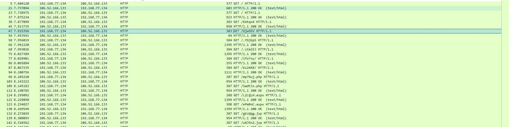
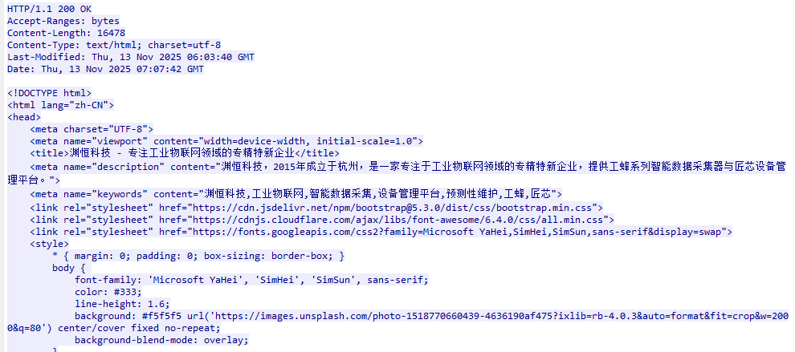
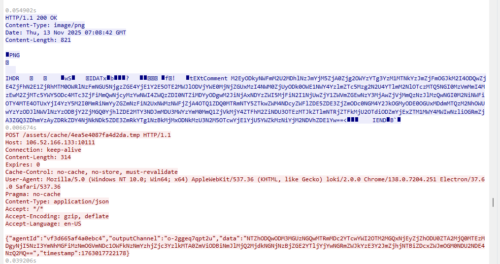

Forensics Challenge: Shadow of Asgard

这是一题取证挑战,我主要参考了[LokiC2](https://github.com/boku7/Loki)的思维写了一个简单的恶意软件，当然为了降低难度，这里并没有采取无基础措施的云上交互，加密也相对简单很多

在这道题中 通过Wireshark打开附件，可以发现 Loki的C2服务器地址为**106.52.166.133**，同时可以获悉Thor和Loki的通信主要以http协议为主，这里就以http作为过滤器过滤



1. Challenge 1: The Merchant's Mask

   Loki, master of disguise, never reveals his true intentions at first glance. His C2 server hides behind a false front—a seemingly legitimate corporate website designed to fool mortal eyes.

   What is the name of the company Loki used as camouflage on his C2 server's front page?

   这里直接找到访问/路径的数据包，一般都是C2基础措施用于作为伪装的首页，可以获悉为**渊恒科技**

   

   

2. Challenge 2: The Parasite's Nest

   Like a serpent hiding in Yggdrasil's roots, Loki's backdoor didn't run standalone—it parasitized an existing process on Thor's machine to avoid detection.

   Identify the complete file path where Loki's C2 agent was running.

   通过题干得知，Thor在对Loki的C2基础措施做目录扫描，这里可以推断得出Thor的目录扫描主要以GET方式为主，因此在后续数据包的排查中，**可以定位到注册Agent的POST请求**，特征比较明显 **/api/init/:uuid**-->**/api/init/7411244dcfc0e6d5**


追踪流：**tcp.stream eq 6** 可以找到Thor的主机和LokiC2的完整交互

这里可以看到 注册的过程中就交换了aesKey aesIV 以及data

```
{"agentId":"vf3d665af4a0ebc4","aesKey":"WzUsMTM5LDI0NSwyMjAsMjMxLDQ2LDIzNCwxNDYsMjQ4LDIxMSwyLDIxMywyLDE2NSw5OCwxMTgsMTAzLDE2MiwzLDE1MCw0LDUzLDE3OSwxOTQsODQsMjA3LDQ1LDI0NSw4OCwxNzksMTkzLDEwMV0=","aesIV":"WzEyNCwyMzIsMjU0LDE5LDI1MCw0OSw1MCw4MywyMjksMjQ0LDI4LDIyMiw4MywzMywyMDIsNl0=","data":"N2M3N2ZlN2ExYTdhZGMxY2E3MmZhMzY4MzgxMjUxMjQ5ZDZlYjAwNDQwZWJhYmQ2ZDc4MTVkMjE2OTVmMjAwNzRkY2JmYjgwYmExZTVjMjc5ZWY1NzZhNTQxMTU2YTQxZGI0NjQ3MGNlYTIzMDVkOTFlNDcxN2MyMTljNGQwNWJhYjRlMGQ5Zjg1MTA5MDNmZGQyNTM1M2ZjODI5NmY3MjgxYTEyODNkODIzMDQ1Y2NkYTI4MDI3OTc2NTljNzUzNzI0M2U0MmRhMTQ4MGY4ZDg0ZWQ2YTRjMDA1MjUyNWRjYWIwMDk2M2MyODA1MGJmNTEzNjA2NzNhODdiOTNiZDg1NTNkNWU3NDMzMjk3YmRkNTRiOTQyMjJjZDUzMzg3NzIwMmYwNTU0MDNiMjRlODU5NzkwY2Q5MzliYTZjNGVmMDNjMTkzYTU0Zjc3NTUyY2MyYzJhOThlMmI3NDhmZWViZGY0ZDc5YTM5YzBkZGFlZjUyMzVmZjY4YWYxM2Y0NjFiYTkzMTAwMjhhODY3NWEzOGNiNGU3MTc0YmY1Y2QwYzY4YzdiOGE5NjczMGNlMTEyMGJjNWRjNWQ3ZDNiNGY0NTkxMzc1MGRiNzJiZjQ3NzU5YWQwNGRiOWQxYTBlYjlhMzRmOGZlNDZmMDM5OGI1YWI5YWMzMDBiZTlkNmU1MTA4ZTM1ZWQ2YTRiYTA1MTJmNjJkMjM1YTc1YzQyMWJhZThhMmNlN2IwNmI0YjA1NDA0OTNmNGVhM2ZjMTc2"}
```

这里可以简单排查data的加密逻辑，可以得知这个加密逻辑是**AES-->hex-->base64**

解密脚本：

```
import base64
import json
from Crypto.Cipher import AES

# 第一步：Base64解码得到十六进制字符串
b64_data = "N2M3N2ZlN2ExYTdhZGMxY2E3MmZhMzY4MzgxMjUxMjQ5ZDZlYjAwNDQwZWJhYmQ2ZDc4MTVkMjE2OTVmMjAwNzRkY2JmYjgwYmExZTVjMjc5ZWY1NzZhNTQxMTU2YTQxZGI0NjQ3MGNlYTIzMDVkOTFlNDcxN2MyMTljNGQwNWJhYjRlMGQ5Zjg1MTA5MDNmZGQyNTM1M2ZjODI5NmY3MjgxYTEyODNkODIzMDQ1Y2NkYTI4MDI3OTc2NTljNzUzNzI0M2U0MmRhMTQ4MGY4ZDg0ZWQ2YTRjMDA1MjUyNWRjYWIwMDk2M2MyODA1MGJmNTEzNjA2NzNhODdiOTNiZDg1NTNkNWU3NDMzMjk3YmRkNTRiOTQyMjJjZDUzMzg3NzIwMmYwNTU0MDNiMjRlODU5NzkwY2Q5MzliYTZjNGVmMDNjMTkzYTU0Zjc3NTUyY2MyYzJhOThlMmI3NDhmZWViZGY0ZDc5YTM5YzBkZGFlZjUyMzVmZjY4YWYxM2Y0NjFiYTkzMTAwMjhhODY3NWEzOGNiNGU3MTc0YmY1Y2QwYzY4YzdiOGE5NjczMGNlMTEyMGJjNWRjNWQ3ZDNiNGY0NTkxMzc1MGRiNzJiZjQ3NzU5YWQwNGRiOWQxYTBlYjlhMzRmOGZlNDZmMDM5OGI1YWI5YWMzMDBiZTlkNmU1MTA4ZTM1ZWQ2YTRiYTA1MTJmNjJkMjM1YTc1YzQyMWJhZThhMmNlN2IwNmI0YjA1NDA0OTNmNGVhM2ZjMTc2"
hex_string = base64.b64decode(b64_data).decode('utf-8')  # 这是文本格式的hex

# 第二步：将十六进制字符串转换为字节
encrypted_data = bytes.fromhex(hex_string)


# 第三步：准备AES密钥和IV（从之前的日志中提取）
aes_key_b64 = "WzUsMTM5LDI0NSwyMjAsMjMxLDQ2LDIzNCwxNDYsMjQ4LDIxMSwyLDIxMywyLDE2NSw5OCwxMTgsMTAzLDE2MiwzLDE1MCw0LDUzLDE3OSwxOTQsODQsMjA3LDQ1LDI0NSw4OCwxNzksMTkzLDEwMV0="
aes_iv_b64 = "WzEyNCwyMzIsMjU0LDE5LDI1MCw0OSw1MCw4MywyMjksMjQ0LDI4LDIyMiw4MywzMywyMDIsNl0="

aes_key = bytes(json.loads(base64.b64decode(aes_key_b64)))
aes_iv = bytes(json.loads(base64.b64decode(aes_iv_b64)))

# 第四步：AES解密
try:
    cipher = AES.new(aes_key, AES.MODE_CBC, aes_iv)
    decrypted = cipher.decrypt(encrypted_data)
    
    # 移除PKCS7 padding
    padding_length = decrypted[-1]
    if padding_length <= 16:  # 验证padding是否合理
        decrypted = decrypted[:-padding_length]
    
    # 尝试解码为UTF-8
    result = decrypted.decode('utf-8')
    print(f"\n解密结果:\n{result}")
    
except Exception as e:
    print(f"解密失败: {e}")
    print(f"原始解密数据（hex）: {decrypted.hex()}")
```

```
解密结果:
{"systemInfo":{"hostname":"DESKTOP-EO5QI9P","username":"dell","osType":"Windows_NT","osRelease":"10.0.17763","platform":"win32","arch":"x64","PID":6796,"Process":"C:\\Users\\dell\\Desktop\\Microsoft VS Code\\Code.exe","IP":["192.168.77.134"],"mode":"egress"},"timestamp":1763017667381}
```


这里解密出来Agent注册时返回的metadata，那么可以获悉找出洛基 C2 代理运行的完整文件路径是C:\\Users\\dell\\Desktop\\Microsoft VS Code\\Code.exe ，这里用到了LokiC2的JS寄生原理


3. Challenge 3: The Hidden Rune

   Loki commanded his agent to reveal its current working directory. But the Trickster is never straightforward—his commands are hidden in layers of encryption and steganography.

   What is the taskId for the pwd command that Loki executed?

这里要求找到C2下发pwd任务的任务ID，那么就需要知道Thor主机怎么从C2服务器获取任务。这里可以排查发现Thor主机会向C2请求assets/logo_uuid.png,从站点业务上这比较反常，**所以可以推测png传递了某些信息，属于图片隐写**


这里根据数据包格式可以发现png为0*0像素的同时 tEXtComment中隐藏了一段加密的数据，通过解密脚本解密得到

```
解密结果:
{"command":"ls","outputChannel":"o-zgq4608uhw","taskId":"2b414ac4"}
```

最后依次寻找assets/logo_:uuid.png 并解密
对应/assets/logo_903830abfe618b5b.png  解密得到

```
{"command":"pwd","outputChannel":"o-1xk645wxtri","taskId":"c0c6125e"}
```

得到taskID为c0c6125e


4.Challenge 4: The Forge of Time

In Midgard, every realm has its moment of creation. Loki probed Thor's machine to learn when its primary storage was first forged.

When was Thor's C: drive created?

同理，只要找到C2下发的命令以及Thor回传的数据即可，Thor回传命令结果的路径则是经过/assets/cache/:uuid.tmp


根据png解密出drives命令，可以解密出

```
解密结果:
Drive: C:
Created: Fri Sep 14 2018 23:09:26 GMT-0700 (Pacific Daylight Time)
Modified: Wed Nov 12 2025 22:52:43 GMT-0800 (Pacific Standard Time)
```


按照要求的格式：2018-09-14 23:09:26 通过Quic4


5. Challenge 5: Raven's Ominous Gift

   "Two ravens sit upon Odin's shoulders: Huginn (thought) and Muninn (memory). But there is a third raven in Norse tales—one that follows Loki, a harbinger of mischief. They say this raven is inauspicious, a dark omen of trickery to come."

   In the final act of his infiltration, Loki left behind a parting gift—a file hidden in plain sight on Thor's compromised machine. This raven's message contains the truth you seek.

   What secret message did Loki hide in the file he uploaded?

   这里可以知道是Loki上传了一份文件，那么就需要定位Loki下发的任务中上传了什么数据。
   解密Thor发给LokiC2的载荷数据</assets/cache/4ea5e4087fa4d2da.tmp>得到

   ```
   File saved to C:\Users\dell\Desktop\Microsoft VS Code\fllllag.txt
   ```

   

那么对应前面下发的任务中大概率就有Loki下发的上传文件任务以及文件信息
解png隐写得到：

```
{"outputChannel":"o-2ggeq7qpt2u","taskId":"shell-upload-1763017722153","fileId":"dd45c631-ec19-40b1-aa1b-e3dea35d21ae","filePath":"C:\\Users\\dell\\Desktop\\Microsoft VS Code\\fllllag.txt","fileData":"UkNURnt0aGV5IGFsd2F5cyBzYXkgUmF2ZW4gaXMgaW5hdXNwaWNpb3VzfQ=="}
```

对fileData解base64：

```
RCTF{they always say Raven is inauspicious}
```

Quic5通过


最后FLag

```
RCTF{Wh3n_Th3_R4v3n_S1ngs_4sg4rd_F4lls_S1l3nt}
```


