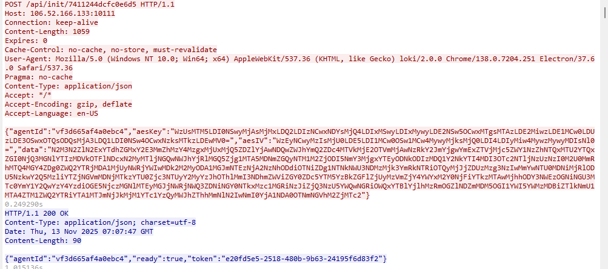
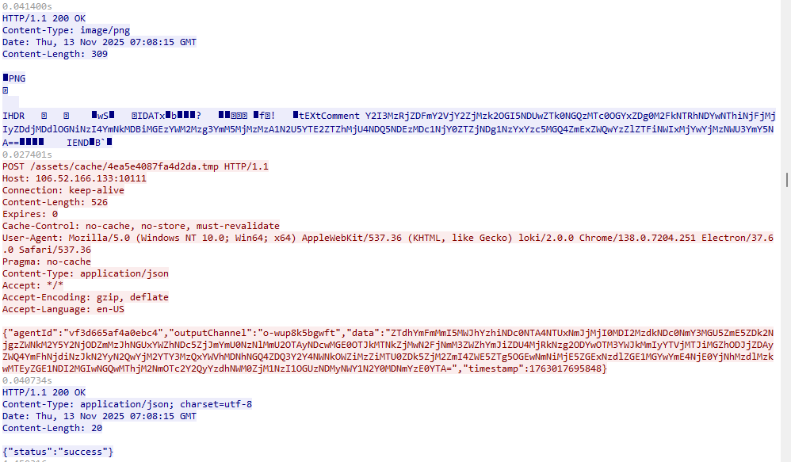

Forensics Challenge: Shadow of Asgard

This is a forensics challenge. I primarily referenced the concept of [LokiC2](https://github.com/boku7/Loki) to write a simple piece of malware.Of course, to reduce the difficulty, this exercise did not employ **cloud-based communication lacking a basic infrastructure (like a VPS or dedicated IP)**, and the encryption used is also relatively simple.

n this challenge, by opening the attached file with Wireshark, you can identify Loki's C2 server address as **106.52.166.133**. Furthermore, you can gather that the communication between Thor and Loki is primarily via the HTTP protocol. Therefore, we will use HTTP as a filter.


1. Challenge 1: The Merchant's Mask

   Loki, master of disguise, never reveals his true intentions at first glance. His C2 server hides behind a false front—a seemingly legitimate corporate website designed to fool mortal eyes.

   What is the name of the company Loki used as camouflage on his C2 server's front page?

   Here, we look for the packet accessing the `/` path, which is usually the C2 infrastructure's default homepage used for camouflage. We can identify the company as **Yuanheng Technology** (渊恒科技).

   

   

2. Challenge 2: The Parasite's Nest

   Like a serpent hiding in Yggdrasil's roots, Loki's backdoor didn't run standalone—it parasitized an existing process on Thor's machine to avoid detection.

   Identify the complete file path where Loki's C2 agent was running.

   

   The problem description implies that Thor is performing directory scanning against Loki's C2 infrastructure. It can be inferred that Thor's directory scanning is mainly performed via **GET** requests. Therefore, in the subsequent packet analysis, we can locate the **POST request for registering the Agent**, which has a distinct feature: **/api/init/:uuid** $\rightarrow$ **/api/init/7411244dcfc0e6d5**.



Following the stream: **`tcp.stream eq 6`** reveals the complete interaction between Thor's host and the Loki C2.

Here we can see that the `aesKey`, `aesIV`, and `data` were exchanged during the registration process:

```
{"agentId":"vf3d665af4a0ebc4","aesKey":"WzUsMTM5LDI0NSwyMjAsMjMxLDQ2LDIzNCwxNDYsMjQ4LDIxMSwyLDIxMywyLDE2NSw5OCwxMTgsMTAzLDE2MiwzLDE1MCw0LDUzLDE3OSwxOTQsODQsMjA3LDQ1LDI0NSw4OCwxNzksMTkzLDEwMV0=","aesIV":"WzEyNCwyMzIsMjU0LDE5LDI1MCw0OSw1MCw4MywyMjksMjQ0LDI4LDIyMiw4MywzMywyMDIsNl0=","data":"N2M3N2ZlN2ExYTdhZGMxY2E3MmZhMzY4MzgxMjUxMjQ5ZDZlYjAwNDQwZWJhYmQ2ZDc4MTVkMjE2OTVmMjAwNzRkY2JmYjgwYmExZTVjMjc5ZWY1NzZhNTQxMTU2YTQxZGI0NjQ3MGNlYTIzMDVkOTFlNDcxN2MyMTljNGQwNWJhYjRlMGQ5Zjg1MTA5MDNmZGQyNTM1M2ZjODI5NmY3MjgxYTEyODNkODIzMDQ1Y2NkYTI4MDI3OTc2NTljNzUzNzI0M2U0MmRhMTQ4MGY4ZDg0ZWQ2YTRjMDA1MjUyNWRjYWIwMDk2M2MyODA1MGJmNTEzNjA2NzNhODdiOTNiZDg1NTNkNWU3NDMzMjk3YmRkNTRiOTQyMjJjZDUzMzg3NzIwMmYwNTU0MDNiMjRlODU5NzkwY2Q5MzliYTZjNGVmMDNjMTkzYTU0Zjc3NTUyY2MyYzJhOThlMmI3NDhmZWViZGY0ZDc5YTM5YzBkZGFlZjUyMzVmZjY4YWYxM2Y0NjFiYTkzMTAwMjhhODY3NWEzOGNiNGU3MTc0YmY1Y2QwYzY4YzdiOGE5NjczMGNlMTEyMGJjNWRjNWQ3ZDNiNGY0NTkxMzc1MGRiNzJiZjQ3NzU5YWQwNGRiOWQxYTBlYjlhMzRmOGZlNDZmMDM5OGI1YWI5YWMzMDBiZTlkNmU1MTA4ZTM1ZWQ2YTRiYTA1MTJmNjJkMjM1YTc1YzQyMWJhZThhMmNlN2IwNmI0YjA1NDA0OTNmNGVhM2ZjMTc2"}
```

A brief analysis of the `data` encryption logic indicates that the encryption steps are **AES-->hex --> base64**.

解密脚本：

```
import base64
import json
from Crypto.Cipher import AES

# Step 1: Base64 decode to get the hexadecimal string
b64_data = "N2M3N2ZlN2ExYTdhZGMxY2E3MmZhMzY4MzgxMjUxMjQ5ZDZlYjAwNDQwZWJhYmQ2ZDc4MTVkMjE2OTVmMjAwNzRkY2JmYjgwYmExZTVjMjc5ZWY1NzZhNTQxMTU2YTQxZGI0NjQ3MGNlYTIzMDVkOTFlNDcxN2MyMTljNGQwNWJhYjRlMGQ5Zjg1MTA5MDNmZGQyNTM1M2ZjODI5NmY3MjgxYTEyODNkODIzMDQ1Y2NkYTI4MDI3OTc2NTljNzUzNzI0M2U0MmRhMTQ4MGY4ZDg0ZWQ2YTRjMDA1MjUyNWRjYWIwMDk2M2MyODA1MGJmNTEzNjA2NzNhODdiOTNiZDg1NTNkNWU3NDMzMjk3YmRkNTRiOTQyMjJjZDUzMzg3NzIwMmYwNTU0MDNiMjRlODU5NzkwY2Q5MzliYTZjNGVmMDNjMTkzYTU0Zjc3NTUyY2MyYzJhOThlMmI3NDhmZWViZGY0ZDc5YTM5YzBkZGFlZjUyMzVmZjY4YWYxM2Y0NjFiYTkzMTAwMjhhODY3NWEzOGNiNGU3MTc0YmY1Y2QwYzY4YzdiOGE5NjczMGNlMTEyMGJjNWRjNWQ3ZDNiNGY0NTkxMzc1MGRiNzJiZjQ3NzU5YWQwNGRiOWQxYTBlYjlhMzRmOGZlNDZmMDM5OGI1YWI5YWMzMDBiZTlkNmU1MTA4ZTM1ZWQ2YTRiYTA1MTJmNjJkMjM1YTc1YzQyMWJhZThhMmNlN2IwNmI0YjA1NDA0OTNmNGVhM2ZjMTc2"
hex_string = base64.b64decode(b64_data).decode('utf-8')  # This is the hex in text format

# Step 2: Convert the hexadecimal string to bytes
encrypted_data = bytes.fromhex(hex_string)


# Step 3: Prepare the AES Key and IV (extracted from the logs)
aes_key_b64 = "WzUsMTM5LDI0NSwyMjAsMjMxLDQ2LDIzNCwxNDYsMjQ4LDIxMSwyLDIxMywyLDE2NSw5OCwxMTgsMTAzLDE2MiwzLDE1MCw0LDUzLDE3OSwxOTQsODQsMjA3LDQ1LDI0NSw4OCwxNzksMTkzLDEwMV0="
aes_iv_b64 = "WzEyNCwyMzIsMjU0LDE5LDI1MCw0OSw1MCw4MywyMjksMjQ0LDI4LDIyMiw4MywzMywyMDIsNl0="

aes_key = bytes(json.loads(base64.b64decode(aes_key_b64)))
aes_iv = bytes(json.loads(base64.b64decode(aes_iv_b64)))

# Step 4: AES Decryption
try:
    cipher = AES.new(aes_key, AES.MODE_CBC, aes_iv)
    decrypted = cipher.decrypt(encrypted_data)
    
    # Remove PKCS7 padding
    padding_length = decrypted[-1]
    if padding_length <= 16:  # Verify if padding is reasonable
        decrypted = decrypted[:-padding_length]
    
    # Attempt to decode to UTF-8
    result = decrypted.decode('utf-8')
    print(f"\nDecryption Result:\n{result}")
    
except Exception as e:
    print(f"Decryption failed: {e}")
    print(f"Raw decrypted data (hex): {decrypted.hex()}")
```

```
Decryption Result:
{"systemInfo":{"hostname":"DESKTOP-EO5QI9P","username":"dell","osType":"Windows_NT","osRelease":"10.0.17763","platform":"win32","arch":"x64","PID":6796,"Process":"C:\\Users\\dell\\Desktop\\Microsoft VS Code\\Code.exe","IP":["192.168.77.134"],"mode":"egress"},"timestamp":1763017667381}
```

By decrypting the metadata returned during Agent registration, we can determine that the complete file path where the Loki C2 agent was running is **`C:\Users\dell\Desktop\Microsoft VS Code\Code.exe`**. This utilizes the JS parasitism principle of LokiC2.


3. Challenge 3: The Hidden Rune

   Loki commanded his agent to reveal its current working directory. But the Trickster is never straightforward—his commands are hidden in layers of encryption and steganography.

   What is the taskId for the pwd command that Loki executed?

This challenge requires finding the Task ID for the `pwd` command issued by the C2. To do this, we need to know how the Thor host retrieves tasks from the C2 server. We can observe that the Thor host requests `/assets/logo_uuid.png` from the C2. This is unusual for typical site business, so **we can infer that the PNG file carries certain information use the image steganography.**


Based on the packet format, we can see that the PNG is 0×0 pixels and a piece of encrypted data is hidden in the `tEXtComment`. Decrypting this data yields:

```
解密结果:
{"command":"ls","outputChannel":"o-zgq4608uhw","taskId":"2b414ac4"}
```

Next, we sequentially search for and decrypt the requests to `/assets/logo_:uuid.png`.

The request for `/assets/logo_903830abfe618b5b.png` decrypts to:

```
{"command":"pwd","outputChannel":"o-1xk645wxtri","taskId":"c0c6125e"}
```


4.Challenge 4: The Forge of Time

In Midgard, every realm has its moment of creation. Loki probed Thor's machine to learn when its primary storage was first forged.

When was Thor's C: drive created?

Similarly, we need to find the command issued by the C2 and the data returned by Thor. Thor returns the command result to the path `/assets/cache/:uuid.tmp`.



Based on the command (drives) decrypted from the PNG steganography, we can decrypt the returned data to find:

```
解密结果:
Drive: C:
Created: Fri Sep 14 2018 23:09:26 GMT-0700 (Pacific Daylight Time)
Modified: Wed Nov 12 2025 22:52:43 GMT-0800 (Pacific Standard Time)
```


The required format for the creation time is: **`2018-09-14 23:09:26`**


5. Challenge 5: Raven's Ominous Gift

   "Two ravens sit upon Odin's shoulders: Huginn (thought) and Muninn (memory). But there is a third raven in Norse tales—one that follows Loki, a harbinger of mischief. They say this raven is inauspicious, a dark omen of trickery to come."

   In the final act of his infiltration, Loki left behind a parting gift—a file hidden in plain sight on Thor's compromised machine. This raven's message contains the truth you seek.

   What secret message did Loki hide in the file he uploaded?

   

   We need to locate the task where Loki uploaded a file. Decrypting the payload data sent by Thor to LokiC2 at `/assets/cache/4ea5e4087fa4d2da.tmp` reveals:

   ```
   File saved to C:\Users\dell\Desktop\Microsoft VS Code\fllllag.txt
   ```

   

Therefore, one of the previous tasks issued by Loki must have been the file upload task and file information. Decrypting the PNG steganography yields:

```
{"outputChannel":"o-2ggeq7qpt2u","taskId":"shell-upload-1763017722153","fileId":"dd45c631-ec19-40b1-aa1b-e3dea35d21ae","filePath":"C:\\Users\\dell\\Desktop\\Microsoft VS Code\\fllllag.txt","fileData":"UkNURnt0aGV5IGFsd2F5cyBzYXkgUmF2ZW4gaXMgaW5hdXNwaWNpb3VzfQ=="}
```

Base64 decoding the `fileData`:

```
RCTF{they always say Raven is inauspicious}
```


Final Flag

```
RCTF{Wh3n_Th3_R4v3n_S1ngs_4sg4rd_F4lls_S1l3nt}
```

