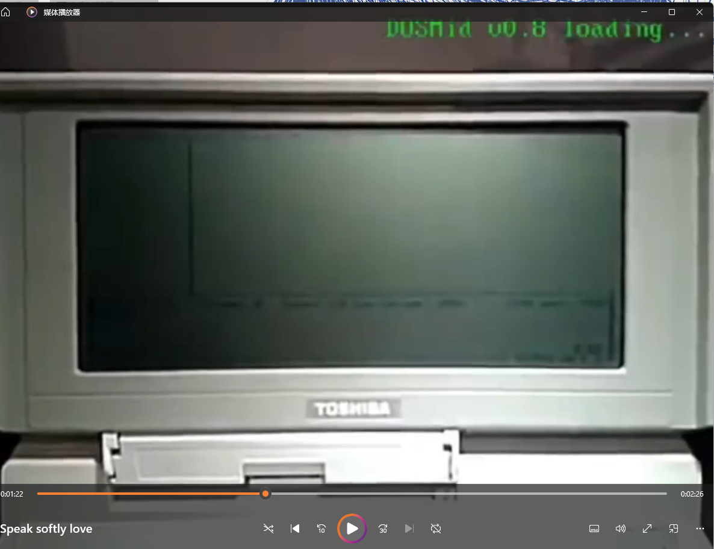
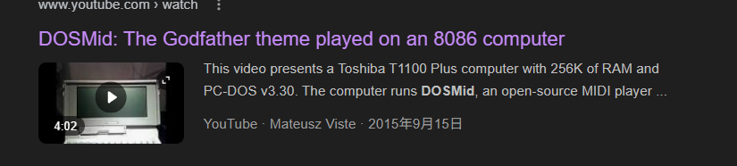
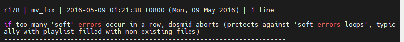
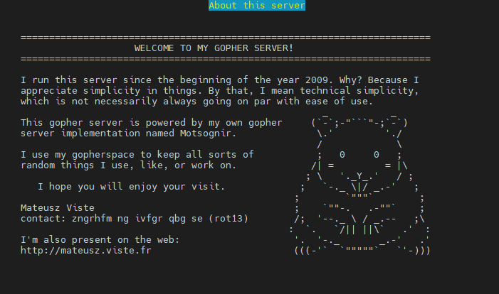

OSINT挑战：SpeakSoftyLove

这是一道OSINT类型的题目，同时以mateusz这位可敬的开发者为主体作为题目的出发点

1. Challenge 1: Video ID

   Even with the limited hardware of that era, this small player could still produce surprisingly gentle melodies. Please help me locate the ID of the original upload of this piec

   附件的视频经过了我**压缩画质和剪辑片尾的处理以保证常规的识图无法成功识别youtube上的原视频**

   因此如果要解开这题，至少需要仔细观察视频从而发现右上角的讯息

   

   只要你有足够的耐心，就能在视频的1：23左右看到右上角的**DOSMID v0.8 loading**， 这便是我题干中指代的播放器软件本体

   

   通过在浏览器检索：**Dosmid youtube** 相信你可以看到这个[Youtube平台的视频](https://www.youtube.com/watch?v=8ssDGBTssUI)，视频ID为**8ssDGBTssUI**，至此得出Quic1的答案




2. Challenge 2: Code Revision

   The developer behind it has quietly maintained his corner of the net for many years. Please help me locate the version entry in the author's own code history where he introduced a safeguard to prevent endless "soft error" loops caused by missing playlist items.

   这里要求寻找开发者在代码历史修订记录中 修复**Soft Error Loops caused by missing playlist items**的内容，那么就需要定位dosmid的源代码仓库，直接通过公共信息检索Dosmid，或者根据你检索到的视频简介，就可以找到**https://mateusz.fr/dosmid/**

   如果你要跟踪对应的代码修订记录，那么不难注意到Dosmid版本控制的SVN仓库


​	直接通过svn log svn://svn.mateusz.fr/dosmid 即可定位到**r178**



 这里致歉一下，在题目描述中对答案格式的要求较为模糊，导致耽误了一些选手的做题时间，十分抱歉QwQ

当然，想要追踪版本控制也可以根据**https://sourceforge.net/p/dosmid/code/178/**跟踪得到题目相关的代码修订

3. Challenge 3: Name-pronunciation URL

   The developer has quietly maintained his corner of the net for many years. Please help me locate the full URL that points to the recording in which he pronounces his own name.

   这题你只要去了解开发者，就能找到他[个人主页](https://mateusz.viste.fr/)的信息描述 下方就有自己的[姓名发音文件链接](https://mateusz.viste.fr/mateusz.ogg)
   

4. Challenge 4: Donation address

   The developer has quietly maintained his corner of the net for many years — a place filled with personal tools, archived ideas, and even a way to show appreciation if his work ever brought you something valuable. Please help me locate the address he published for donations in digital currency.

   这里可能有些人会找到https://mateusz.fr/下方的隐秘档案馆，甚至翻阅到这个隐蔽档案馆最底部关于mateusz创建的2008-oldPage

   

   不过上述的站点并没有关于mateusz 展出存档想法的内容。因此这个隐秘的网络节点能够符合要求的 只有mateusz 自己经营的一个**GopherSpace节点**

   

   

   由于大多数现代浏览器没有对Gopher网络节点访问做出兼容，因此可以通过lynx进行访问

   ```
     lynx gopher://gopher.viste.fr
   ```

   

   下拉找到Donate som BTC bits的目录并Enter，就能找到mateusz对应的Bitcoin地址：**16TofYbGd86C7S6JuAuhGkX4fbmC9QtzwT**


最后得到Flag

```
RCTF{wh3n_8086_s4ng_s0f7ly_0f_l0v3}
```

