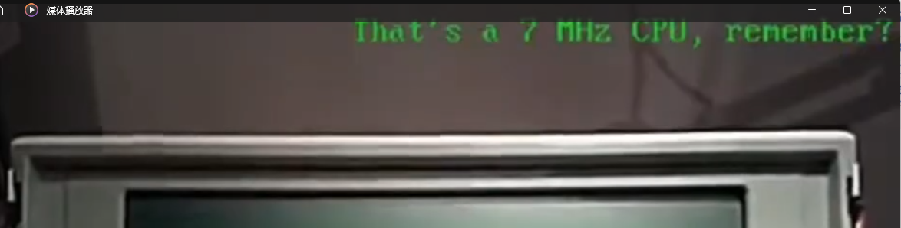
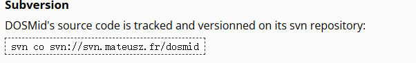
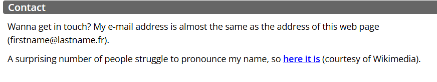
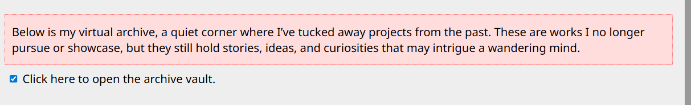
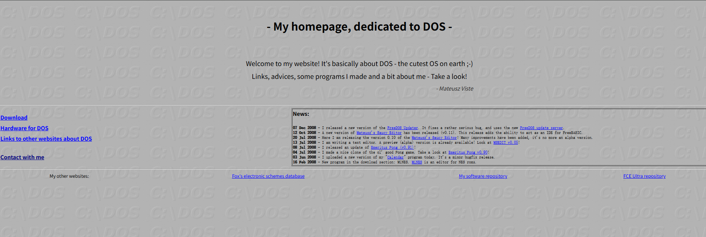
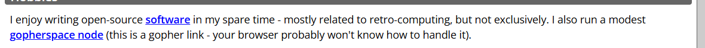
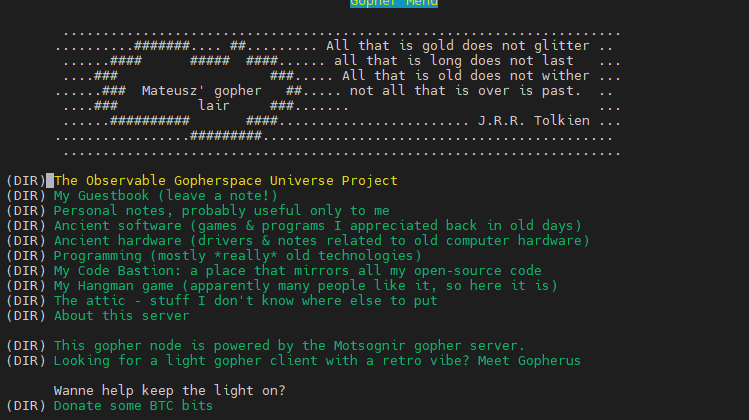

OSINT Challenge: SpeakSoftyLove

This is an OSINT (Open-Source Intelligence) challenge centered around the respected developer, Mateusz.

1. Challenge 1: Video ID

   Even with the limited hardware of that era, this small player could still produce surprisingly gentle melodies. Please help me locate the ID of the original upload of this piec

   The attached video has been **compressed in quality and the end clip has been edited to prevent conventional image recognition from successfully identifying the original YouTube video**.

   Therefore, to solve this challenge, you need to observe the video carefully to find the information in the upper right corner.

   

   If you have enough patience, you will see "**DOSMID v0.8 loading**" in the upper right corner around the **1:23** mark of the video, which is the music player software referred to in the prompt

   

   By searching the browser for: **Dosmid youtube**, you will likely find this [YouTube video](https://www.youtube.com/watch?v=8ssDGBTssUI). The video ID is **8ssDGBTssUI**. This concludes the answer for Challenge 1.


2. Challenge 2: Code Revision

   The developer behind it has quietly maintained his corner of the net for many years. Please help me locate the version entry in the author's own code history where he introduced a safeguard to prevent endless "soft error" loops caused by missing playlist items.

   This challenge requires finding the developer's code revision history entry that fixed the **Soft Error Loops caused by missing playlist items**. To do this, you need to locate the Dosmid source code repository.

   Searching for "Dosmid" using public information, or following the description in the video found in Challenge 1, will lead you to **https://mateusz.fr/dosmid/**.

   If you track the corresponding code revision history, you will easily notice the SVN repository for Dosmid version control.



​	Directly running `svn log svn://svn.mateusz.fr/dosmid` points to **r178**.


I apologize for the vague requirements for the answer format in the original prompt, which may have delayed some contestants. I am very sorry QwQ.

Alternatively, you can track the version control by following **https://www.google.com/search?q=https://sourceforge.net/p/dosmid/code/178/** to find the relevant code revision for the question.

3. Challenge 3: Name-pronunciation URL

   The developer has quietly maintained his corner of the net for many years. Please help me locate the full URL that points to the recording in which he pronounces his own name.

   To solve this, you need to learn about the developer and find the description on his [personal homepage](https://mateusz.viste.fr/). The link to the file for his [name pronunciation](https://mateusz.viste.fr/mateusz.ogg) is located below the information)
   

4. Challenge 4: Donation address

   The developer has quietly maintained his corner of the net for many years — a place filled with personal tools, archived ideas, and even a way to show appreciation if his work ever brought you something valuable. Please help me locate the address he published for donations in digital currency.

   Some people might find the hidden archive under `https://mateusz.fr/`, or even look through the 2008-oldPage created by Mateusz at the very bottom of this hidden archive.

   

   However, the sites mentioned above do not contain the "archived ideas" section about Mateusz. Therefore, the only hidden network node that meets the requirement is a **GopherSpace node** maintained by Mateusz himself.

   

   

   Since most modern browsers do not support access to the Gopher network node, you can access it using `lynx`.

   ```
     lynx gopher://gopher.viste.fr
   ```

   

   Scroll down to the "Donate som BTC bits" directory and press Enter. You will find Mateusz's corresponding Bitcoin address: **16TofYbGd86C7S6JuAuhGkX4fbmC9QtzwT**.


**Final Flag**

RCTF{wh3n_8086_s4ng_s0f7ly_0f_l0v3}