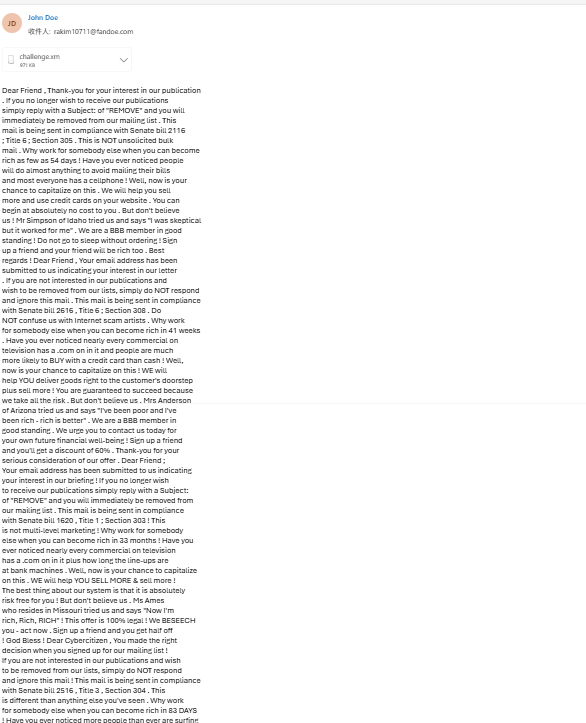
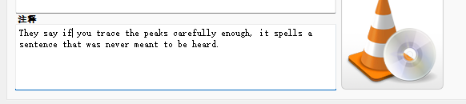
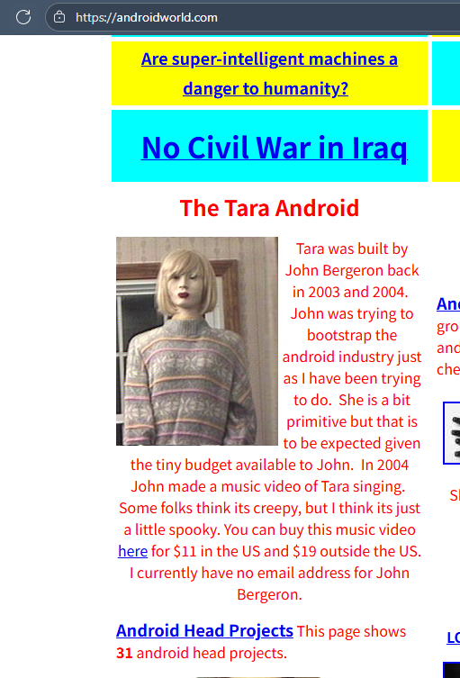
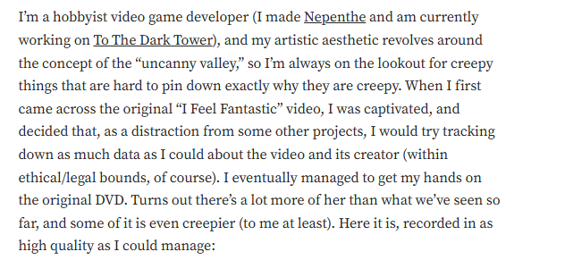
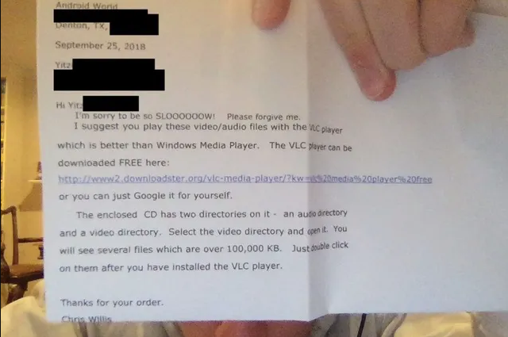

A CTF Challenge Write-up (Crypto + Steganography + OSINT)

The inspiration for this challenge came from digital art from the DOS system era and urban legends surrounding lost media.

The challenge provides an email with an attached XM format audio file.


1. Challenge 1

   She only wanted to sing, but her voice was hidden in silence. What is this email trying to tell you? Look beyond what you hear — seek the whispers in the shadows, the comments that were never meant to be seen.

   This section primarily tests a basic encryption format: **Spam Mimicry Encryption**.

   

   You only need to input the body content of the EML file into [Spammic](https://www.spammimic.com/decode.shtml) to decrypt the answer, along with a hint for the next challenge:

   ```
   Don't just listen to the sound; this file is hiding an 'old relic.' Try looking for the 'comments' that the player isn't supposed to see.
   ```

   (Author's note: My apologies to CTFers who, seeing the prompt, might have initially focused on the XM audio format. This was a lapse in my challenge design experience. QWQ)

2. Challenge 2

   She wants to tell you something, encoded in melodies. Within the digital symphony, her true voice emerges. What is the hidden message found in the XM file? The words she longed to sing, the feeling she wanted to share.

   The second challenge focuses on **steganography within the XM file**.

   If you open the XM file directly using players like VLC Player or [JavaScript XMPlayer](https://www.a1k0n.net/code/jsxm/), the information you can extract is generally the title, **"How Do you Feel?"**, and some other embedded media messages:

   ```
   Song Message：They say if you trace the peaks carefully enough, it spells a sentence that was never meant to be heard.
   Instruments:Can Anybody Extract The urban Legend Infor-mation About "Feel"  
   From this XM file
   ```

   




However, the key information was hidden through a modification of the XM format:

```
# XM File Format:
    # Offset 0x00-0x11: "Extended Module: " (17 bytes)
    # Offset 0x11-0x1D: Module Name (20 bytes)
    # Offset 0x1D: 0x1A (End of file marker)
    # Offset 0x1E-0x21: Other fields
    # Offset 0x21-0x35: Tracker Name (20 bytes)
```

The tracker name was changed to **"the OpenMPT knows"**, suggesting that participants should use the OpenMPT tracker to inspect the XM file's information. Combined with the comment **"They say if you trace the peaks carefully enough, it spells a sentence that was never meant to be heard."**, it's highly likely to deduce that the **audio steganography is implemented through waveform or spectrum analysis**.

During the tracking process, it can be observed that the XM file contains five Samples with corresponding waveforms. Sample 5 is never triggered and has an unusually abnormal waveform. This sample can be exported and an attempt made to decrypt its content.


By selecting "save sample" in the console, Sample 5 is exported as `Feel.wav`.

Typically, in waveform-based challenges, after observing an anomaly, relevant software (such as Audacity, Adobe Audition, etc.) is used to analyze the waveform pattern. The waveform is then converted into a binary string (01 string) to extract and translate the final flag.

The decrypted message is:

```
I Feel Fantastic heyheyhey
```

3. Challenge 3

   She just feels love, and her legend once spread across YouTube. Her song touched hearts, but the original video on the YouTube platform has been removed — deleted, re-uploaded, distorted, like memories fading with time. Through the fragments of public records, find where her voice first echoed: the original video ID, upload date (YYYY-MM-DD), and the one who first shared her song.

   

   This challenge involves **OSINT tracking of an urban legend**. To find the distorted original video, the usual method is to locate references on the internet and utilize the WayBack Machine archive.

   

   The original video ID, **rLy-AwdCOmI**, and the uploader, **Creepyblog**, can be found via a Wiki article.

   Due to a potential archiving anomaly, a Wayback Machine link (`https://web.archive.org/web/20220524020000/https://www.youtube.com/watch?v=G1wsCworwWk&t=644s`) showed comments about *Mission Impossible 6*, and the upload time was also distorted.

   

   The solution is to navigate to an earlier archive snapshot where the YouTube front-end was correctly crawled without display issues. This reveals the original upload date: **2009-04-15**.


4.Challenge 4

Her creator captured her voice, preserved in a 15-minute audio/video DVD. She only wanted to sing, and he gave her that chance. If you wish to purchase her album, to hear her songs of love, which link should you visit? After purchasing, who is the sender? And what is the actual creation year when these musical compositions first came to life?


This requires finding the DVD and album for the robot. The developer's Android Robot Tara and a promotional page for her album can be located at `https://geocities.ws/androidmusicvideos/`.


The page links to where DVDs are available: `http://www.androidworld.com/`.



Clicking the website allows searching for the Robot and specifically finding the music video purchase option


The album sales link is: `[Android Music Videos](https://androidworld.com/prod68.htm)`.


However, the sender is not simply the developer. The intention is to explore the truth behind the lost media. By researching the urban legend, an article on **Medium** (`https://yitzilitt.medium.com/the-story-behind-i-feel-fantastic-tara-the-singing-android-and-john-bergeron-fc83de9e8f36`) discusses the story. The author, **Yitzi Litt**, even managed to obtain the original DVD.



The author received the package several months after purchase, which included a note. From this, it can be deduced that the DVD sender is the operator of the Androidworld website: **Chris Willis**



Furthermore, in subsequent investigation, the author found that the Mac metadata for the video provided a last modification date in **2004**. This resolves Challenge 4.


5. Challenge 5

   Some called her creator a murderer, others said he built her out of love. She only wanted to sing. She wants to tell you. She just feels love. The truth lies in older archives — an obituary, a quiet memorial, where the story of her creator rests in digital silence. Find the developer's digital grave. (URL, no trailing slash)

By reading the entire Medium article, a comment from Rick Hodges can be found that mentions the **digital grave** of the developer, John Bergeron:

```
https://www.findagrave.com/memorial/63520325/john-louis-bergeron
```

This concludes the challenge.


