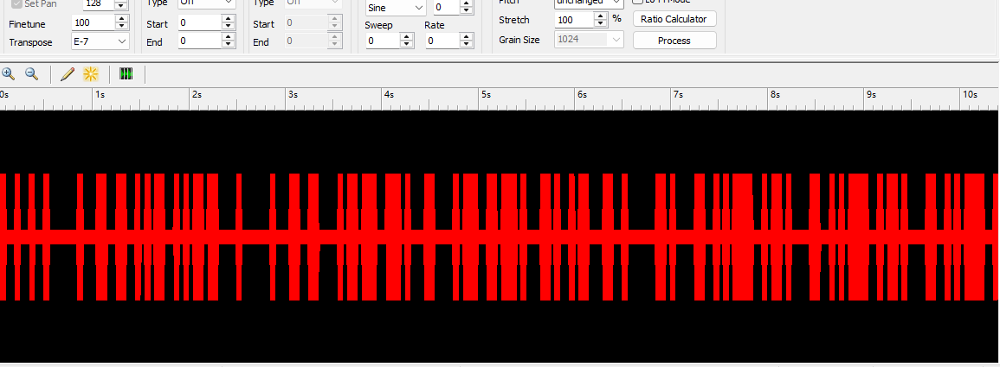

这是一题大杂烩 加密+隐写+OSINT挑战: WannaFeelLove

这题的出题灵感来源于DOS系统时代的一些数字艺术以及都市传说失传媒体


题目给了一份邮件，邮件中的附件为XM格式的音频文件。

1. Challenge 1

   She only wanted to sing, but her voice was hidden in silence. What is this email trying to tell you? Look beyond what you hear — seek the whispers in the shadows, the comments that were never meant to be seen.

   这里主要考的是一种基础的加密格式，**垃圾邮件加密**

   

   只需要将eml中的正文内容抛给[Spammic](https://www.spammimic.com/decode.shtml)解密，就能解密出答案 以及下一个测试的提示：

   ```
   Don't just listen to the sound; this file is hiding an 'old relic.' Try looking for the 'comments' that the player isn't supposed to see.
   ```

   这里致歉QwQ,可能很多CTFer看到**'Look beyond what you hear — seek the whispers in the shadows, the comments that were never meant to be seen.'**，会认为是从XM这个音频格式入手，这里对没能对上脑电波的师傅们诚挚道歉，这是我出题经验上的缺失影响了大家的做题体验。

2. Challenge 2

   She wants to tell you something, encoded in melodies. Within the digital symphony, her true voice emerges. What is the hidden message found in the XM file? The words she longed to sing, the feeling she wanted to share.

   第二题就是关于XM 隐写的内容了，如果直接通过VLC Player/ [JavaScript XMPlayer](https://www.a1k0n.net/code/jsxm/)等播放器打开XM文件


能够提取到的信息大概就是标题为**How Do you Feel?**，以及一些其他留下的媒体信息

```
Song Message：They say if you trace the peaks carefully enough, it spells a sentence that was never meant to be heard.
Instruments:Can Anybody Extract The urban Legend Infor-mation About "Feel"  
From this XM file
```


不过关键的信息我通过对XM格式的篡改实现了隐藏

```
    # XM文件格式：
    # 偏移0x00-0x11: "Extended Module: " (17字节)
    # 偏移0x11-0x1D: 模块名称 (20字节)
    # 偏移0x1D: 0x1A (文件结束标记)
    # 偏移0x1E-0x21: 其他字段
    # 偏移0x21-0x35: 追踪器名称 (20字节) 
```

将追踪器名称改为了 **the OpenMPT knows**， 提示做题者使用OpenMPT追踪，观察这个XM文件的信息，再结合**They say if you trace the peaks carefully enough, it spells a sentence that was never meant to be heard.**这个注释，大概率可以推测出这个**音频的隐写是通过波形隐写/频谱隐写实现的**

在追踪过程中，可以发现XM文件中有五个Sample以及对应的波形采样，其中Sample5从未被调动且波形比较异常，可以导出并尝试解密其中的内容




这里在控制台选择save sample，将sample5导出为Feel.wav,并进行解密

通常来说，波形方向的题，在观察到异常后，使用相关软件（Audacity, Adobe Audition 等）观察波形规律，将波形进一步转化为 01 字符串等，从而提取转化出最终的 flag。

可以解密得出

```
I Feel Fantastic heyheyhey
```

3. Challenge 3

   She just feels love, and her legend once spread across YouTube. Her song touched hearts, but the original video on the YouTube platform has been removed — deleted, re-uploaded, distorted, like memories fading with time. Through the fragments of public records, find where her voice first echoed: the original video ID, upload date (YYYY-MM-DD), and the one who first shared her song.

   这里就到了OSINT 追踪都市传说的环节， 那么想要找到这个被扭曲的原始视频，一般都是通过互联网上的引用配合WayBack Machine互联网档案馆实现定位。

   

   这里通过Wiki百科就能找到原始视频的ID--rLy-AwdCOmI和上传者 Creepyblog

   但可能是由于归档爬取异常，**评论区都是关于碟中谍6的探讨，可以定位到https://web.archive.org/web/20220524020000/https://www.youtube.com/watch?v=G1wsCworwWk&t=644s** 同时上传时间也被扭曲

   

   这个时候只需要将时间轴拉到更早之前，这个时候归档爬取youtube的前端并没有出现异常问题，此时就能获取到上传的时间 **2009-04-15**


4.Challenge 4

Her creator captured her voice, preserved in a 15-minute audio/video DVD. She only wanted to sing, and he gave her that chance. If you wish to purchase her album, to hear her songs of love, which link should you visit? After purchasing, who is the sender? And what is the actual creation year when these musical compositions first came to life?

这里就需要找到关于这个机器人的DVD和专辑了，通过https://geocities.ws/androidmusicvideos/可以定位到开发者开发的android Robot Tara 以及他为Tara实现的一张专辑宣传


同时可以定位到Dvd's are available here [Androidworld.com](http://www.androidworld.com/)


点开网站就可以检索到这个Robot，同时详细定位到 you can buy this music video


```
[Android Music Videos](https://androidworld.com/prod68.htm)
```

通过这个链接，我们可以定位到这个带有五个曲目的专辑售卖链接


但如果你想定位到发件人，绝对不是直接回答开发者本身这么简单。 我希望做题者去探索失传媒体背后的真相，如果愿意研究，**可以找到[Meduim](https://yitzilitt.medium.com/the-story-behind-i-feel-fantastic-tara-the-singing-android-and-john-bergeron-fc83de9e8f36)上面对于这个都市传说的讨论**
对于[Yitzi Litt](https://yitzilitt.medium.com/?source=post_page---byline--fc83de9e8f36---------------------------------------),我愿意对他探索真相的精神致以最高的敬意，为了找到这个都市传说背后的真相，甚至设法弄到了原版的DVD


他在这个网站购买DVD几个月后收到了包裹，其中还**涵盖了一张纸条**，可以从这里看出，DVD发件人就是这个androidWorld网站的运维者，也就是**Chris Willis**


同时在后续的调查中，他发现了这个视频的Mac元数据表单提供的最后修改日期是在2004年


那么Quic4也就解决了


5. Challenge 5

   Some called her creator a murderer, others said he built her out of love. She only wanted to sing. She wants to tell you. She just feels love. The truth lies in older archives — an obituary, a quiet memorial, where the story of her creator rests in digital silence. Find the developer's digital grave. (URL, no trailing slash)


   如果看完了整篇文章，可以在评论区中发现Rick Hodges提及的 关于开发者约翰·伯杰龙的数字坟墓
   https://www.findagrave.com/memorial/63520325/john-louis-bergeron


本题也就此完结
