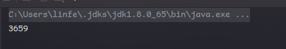
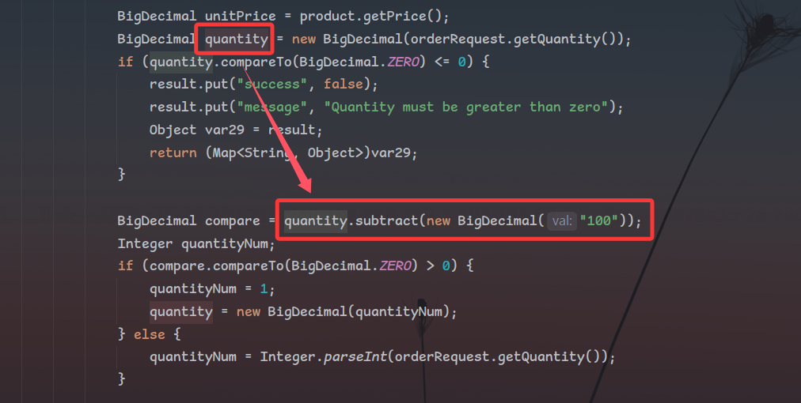
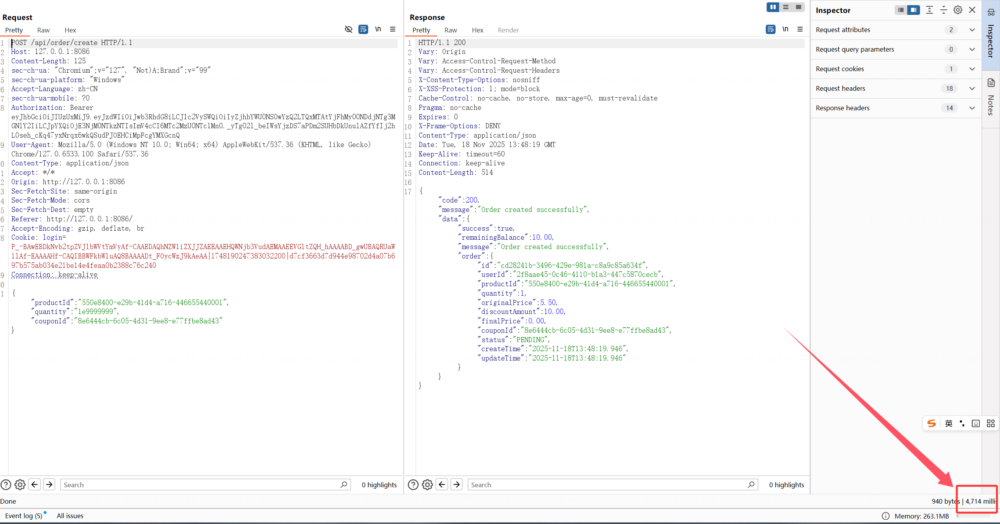
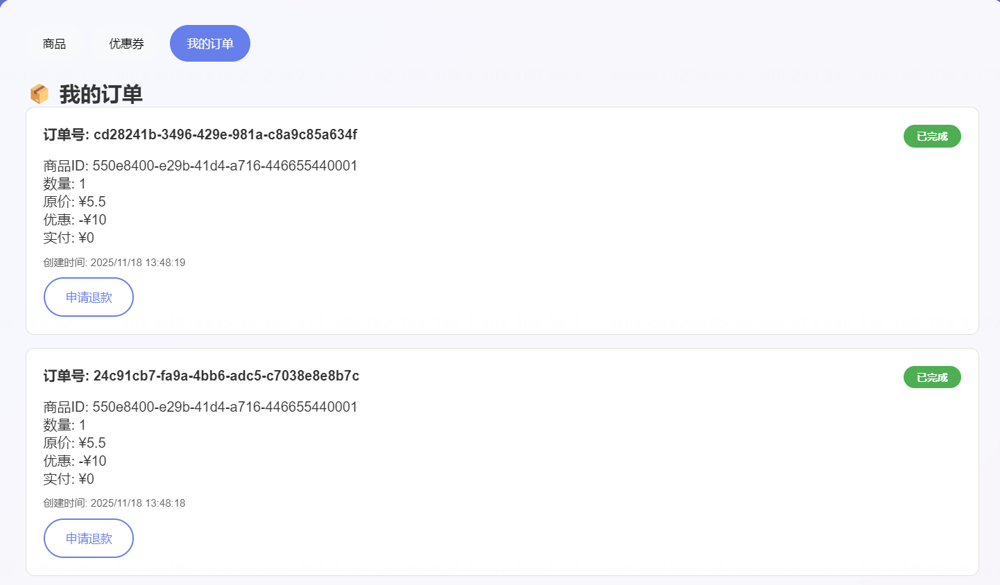
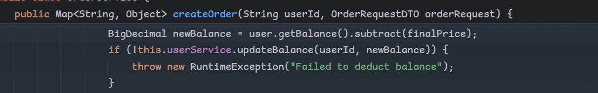
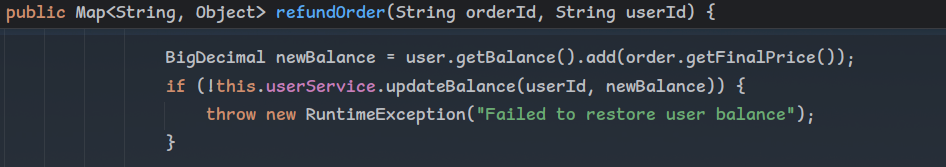

## UltimateFreeloader

> Hey guys! I’m Potatowo. I recently heard that the supermarket downstairs launched a new shopping website, and I somehow got hold of its source code. Let’s team up to milk it for freebies!

解压反编译附件jar包，结合大致体验后收集关键信息：

- 可以注册任意用户，新用户注册后有10元现金与一张10元优惠券
- 退款订单和创建订单均有redis锁，并发利用初步被限制
- flag获取条件为：需要在拥有四种商品的同时，不消耗任何余额与优惠券

假设不存在锁的限制，我们很容易想到应该使用并发的方式去同时下单多个订单，多个订单在创建时，若A订单尚未让coupon.isUsed设置为false，我们此时B订单仍可用优惠券，就会导致A订单和B订单都是使用优惠券后的零元购，此时只需要退款其中一个订单，我们就实现了不使用优惠券、不使用一分钱，但是成功白嫖到商品。

但是本题中存在锁。

提供两种思路：

### 预期解法

在交易等涉及高精度数值运算的场景下常用到BigDecimal类，但是BigDecimal高精度的运算的代价是极高的性能损耗，在Java中若BigDecimal的入参可控，创建的对象若进行加减乘除等运算则会有Dos的风险：

Poc：

```java
package com.rois;

import java.math.BigDecimal;

public class Main {
    public static void main(String[] args) {
        BigDecimal num = new BigDecimal("1e9999999");
        Long startTime = (Long) System.currentTimeMillis();
        BigDecimal num1 = new BigDecimal("1111");

        BigDecimal res =  num.add(num1);
        Long endTime = (Long) System.currentTimeMillis();
        System.out.println(endTime - startTime);
    }
}
```



运行会发现居然产生了接近4秒的延迟

单单一个dos有什么意思，有什么办法可以让他变的更有趣些嘞？

如果在一个业务中存在着锁限制着并发，但是业务逻辑中又存在着这么个dos，是不是就有办法将代码卡在这一行，”硬拖“着这个锁被释放呢？出题的灵感就在这么出来了。

回到题目代码中，我们会发现`OrderService.createOrder()`中的业务逻辑如下：

创建3秒的redis锁->判断优惠券是否可用->进行总价计算->使用优惠券、更新余额

在进行总价计算这一步中，我们注意到我们可控的quantity正是字符串类型，被传入BigDecimal的构造函数中并与BigDecima("100")进行减法运算，满足上面产生Dos的条件

同时能够注意到这里对数额巨大的数值也做了限制，如果数值过大会让最终商品数量恢复为1，因此即使我们传入一个很大的数值也只花一个商品应花的价格



同时我们注意到，使用优惠券的逻辑在dos风险点后，判断优惠券可用性在dos风险点前，如果我们的订单A传入了quantity=1e9999999令代码卡在这一行，等待3秒后redis锁释放，此时dos还未结束，由于此时还没有走到更新优惠券的逻辑优惠券仍然可用，因此我们可以创建另一个使用优惠券的订单B，等待dos结束后update优惠券的状态为false，此时我们已经成功创建了两个使用优惠券的订单，退款其中任意一个订单即可将余额恢复如初并且恢复优惠券为未使用，以此来实现零元购

3秒后等待锁被释放，发起创建另一个订单的请求






### 另一种思路

经过观察，对于创建订单的锁，键为`"order:user:" + userId`，对于取消订单的锁，键为`"refund:order:" + orderId`，那么即使在创建/撤销订单时无法竞争，但是却存在创建订单和撤销订单之间的竞争。

继续观察代码：

创建订单处，将用户的余额获取出来后再减去总价格后更新数据库



撤销订单处使用类似的逻辑



创建订单与退款锁不同，由于同时发起竞争时初态userBalence是一样的，因此存在以下竞争可能：

如果用户已经使用优惠券下单商品，余额为10，使用优惠券

建立以下两个线程T1和T2

| 创建订单T1(不使用优惠券)                                     | 撤销订单T2                                                   |
| ------------------------------------------------------------ | ------------------------------------------------------------ |
| 获取用户余额10（优惠券不可用）                               |                                                              |
|                                                              | 获取用户余额10（优惠券不可用）                               |
| 用户余额update为扣除finalPrice后余额（优惠券不可用，最终余额小于10） |                                                              |
|                                                              | 用户余额update为恢复finalPrice后余额（优惠券可用，余额恢复到10） |

从而实现不花钱不使用优惠券但是能够购入商品，相同的思路分别对4种商品进行竞争